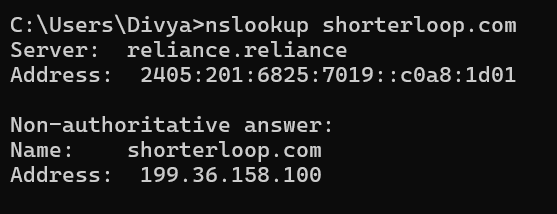
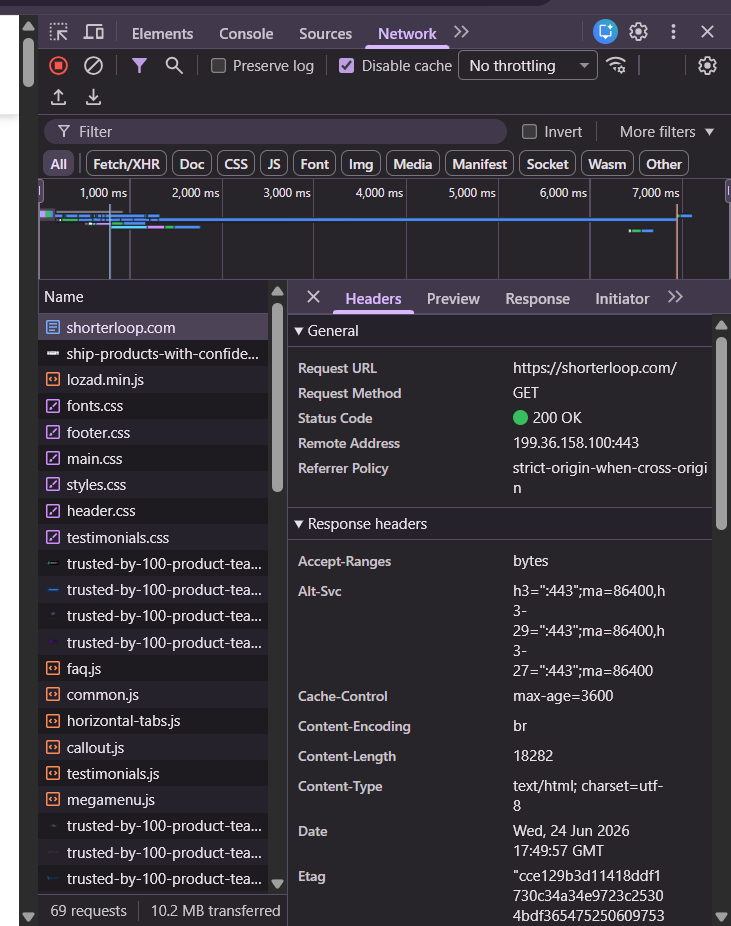

-----------------------DAY1-TASK------------------------------

 ## --------What Happens When You Hit Enter --------------
***A look under the hood of loading 
shorterloop.com: DNS resolution → TCP/TLS handshake → HTTP request/response → browser paint.
 "Instant" is actually a chain of several 
distinct steps happening in milliseconds.***

### 1. DNS Resolution

  Ran in Windows Command Prompt: 
'''
 
 


'''


###2. Network Tab — Request Breakdown

   Captured from Chrome DevTools → Network tab while loading
   shorterloop.com (cache disabled, full reload).


|---|-------------------|-----------|-----------|------------------------------------------|
| # | Request           | Type      | Status    |       Key Header                         |
|---|-------------------|-----------|-----------|------------------------------------------|
| 1 | GET /             | document  | 200 OK    |     content-type: text/html              |
| 2 | GET / styles.css  |stylesheet | 200 OK    |     content-type: text/css               |
| 3 | GET /main.css     | stylesheet| 200 OK    |     content-type: text/css               |
| 4 | GET /lozad.min.js | script    | 200 OK    |     content-type: application/javascript |
| 5 | GET /faq.js       | script    | 200 OK    | content-type: application/javascript     |

Full detail on the main document request (GET /):
- Status Code: 200 OK

- Remote Address: 199.36.158.100:443

- Cache-Control: max-age=3600

- Content-Encoding: br (Brotli compression)

- Content-Length: 18282

- Referrer-Policy: strict-origin-when-cross-origin

***The page also loaded several more CSS/JS files in parallel
 (fonts.css, header.css, footer.css, testimonials.css,
common.js, horizontal-tabs.js, callout.js, megamenu.js, etc.) —
 over 65 requests and ~10.2 MB transferred in total for the full page.***

'''




'''

### 3. The Full Journey (Summary)

  1. DNS — Browser asks a DNS resolver to translate
     shorterloop.com into an IP address: 199.36.158.100.

  2. TCP Handshake — Browser and server
     (199.36.158.100:443) exchange SYN / SYN-ACK / ACK to
     open a connection.

  3. TLS Handshake — Certificates are verified and an
     encrypted channel is negotiated (port 443 = HTTPS).

  4. HTTP Request/Response — Browser sends GET /, server
     responds 200 OK with compressed HTML, then the
    browser kicks off ~65 more requests for CSS, JS, fonts,
    and images.

  5. Render — Browser parses HTML, builds DOM, applies CSS,
     executes JS, paints pixels on screen

 ### Key Takeaway ###
What feels like an instant page load is actually a layered
pipeline — DNS lookup, secure connection setup, dozens of
parallel resource fetches, then rendering. Understanding each
layer makes debugging slow sites or failed connections way
easier later on.

---------------------DAY-2 TASK--------------------------------

##-------------- HTML Resume--------------

## Overview
***Built a semantic HTML resume using only HTML5 elements without CSS, `<div>`, or `<span>`. The project focuses on creating a structured and accessible resume using semantic tags.***

## Features
- Semantic HTML5 structure
- Navigation menu
- About section
- Education details
- Technical skills
- Projects
- Certifications
- Contact information
- Profile image
- Footer declaration

## Technologies Used
- HTML5

## Learning Outcomes
- Semantic HTML elements
- Internal page navigation
- Tables
- Lists
- Images
- Hyperlinks
- Resume structuring

## Project Structure

```
Day-02-HTML-Resume/
│── index.html
│── profile.jpg
```


--------------------Day3-task--------------------------

##---------Introduction to Git & GitHub-----------------


# What I Learned Today

Today I learned the basics of **Git** and **GitHub**, how they help developers manage code, and why version control is important in software development.


#  Version Control System (VCS)

A Version Control System is a tool that keeps track of every change made to a project. It allows developers to go back to previous versions, compare changes, and work safely without losing code.


#  Before Git

Before Git, developers usually created multiple copies of their projects with names like:


Project_Final
Project_Final_v2
Project_Final_Last
Project_Final_Final


This method was confusing, time-consuming, and made collaboration difficult.


#  What is Git?

Git is a **distributed version control system** that runs on a local computer

It helps developers:
- Track code changes
- Save project history
- Restore previous versions
- Work on projects without affecting the original files


#  What is GitHub?

GitHub is a cloud platform where Git repositories are stored online.

It allows developers to:
- Backup projects
- Share code
- Collaborate with others
- Access repositories from anywhere


#  Git vs GitHub

| Git | GitHub |
|------|---------|
| Software installed on a computer | Cloud platform |
| Works locally | Works online |
| Tracks project versions | Stores Git repositories |
| Doesn't require internet | Internet is required for syncing |


#  Repository

A repository (repo) is a folder that stores a project along with its complete version history.


# Shared Repository

A shared repository allows multiple developers to work on the same project by sharing code and updates.


#  Dedicated Repository

A dedicated repository is used and managed by a single developer or team for a specific project.


# Git Workflow


Create Project
      ↓
git init
      ↓
Make Changes
      ↓
git add
      ↓
git commit
      ↓
git push
      ↓
GitHub Repository


#  Git Commands Practiced

### git init
Creates a new Git repository.

### git clone
Copies an existing GitHub repository to the local computer.

### git status
Shows the current status of files.

### git add .
Adds all modified files to the staging area.

### git commit -m "message"
Saves a snapshot of the project with a meaningful message.

### git push
Uploads local commits to GitHub.

### git pull
Downloads the latest changes from GitHub.

### git branch
Displays the current branch and available branches.


# Key Takeaways

- Understood the importance of Version Control.
- Learned the difference between Git and GitHub.
- Practiced commonly used Git commands.
- Created and managed a Git repository.
- Uploaded a project to GitHub.
- Built a semantic HTML resume.

---

##  Learning Outcome

Today I understood how Git records every change in a project and how GitHub makes it easy to store, manage, and share code. I also practiced the basic Git workflow by creating a repository, committing changes, and pushing my project to GitHub.


-------------***DAY-4 & DAY-5 TASK IS IN ANOTHER REPO (name Resume)***----------------------------------


# ---------------------JavaScript & the DOM — Day 6------------------------------------------------------

 So today in my full stack class, I learned how JavaScript actually connects with a webpage. Let me explain it to you the way I understood it.

## 1. What even is JavaScript doing here?

So basically, a website is built by three languages, and each one has its own job:

- **HTML** builds the structure — think of it as the skeleton of the page
- **CSS** makes it look nice — like clothes on that skeleton
- **JavaScript** is the brain — it makes the page actually *do* things

Before today, my pages were just sitting there like posters. After today, they can respond when someone clicks, types, or interacts with them. That's the whole point of JS.

## 2. Okay, so what's the DOM?

DOM stands for **Document Object Model**. This was the biggest "ohh" moment for me today.

Here's the thing — when your browser loads an HTML file, it doesn't just show it as plain text. It secretly converts every single tag into an *object*, and arranges all these objects into a tree structure. That tree is the DOM.

So something like this:

```
document
   ↓
  body
   ↓
 div#card
  ╱ | ╲
 h1 p  button
```

This means my `<h1>`, my `<p>`, my `<button>` — they're not just static text sitting in a file anymore. They're actual live objects that JavaScript can grab and mess with while the page is running. That's wild when you think about it.

One thing my mentor made clear — the DOM is **not** part of JavaScript itself. It's something the *browser* gives us. The browser builds this tree, and then hands JS some tools like `document.querySelector()` to go in and read or change that tree.

## 3. Nodes are basically a family tree

Every single node (element) in the DOM has a parent, children, and siblings — exactly like a family.

```
      parent
      ╱    ╲
    you    sibling
```

Like if I have this structure:

```
h1
 ↓
 p
 ↓
button
```

The `h1` is the "older sibling," `p` comes right after it, and `button` comes after that. Thinking of it this way honestly made the traversal stuff (which I'll explain in a bit) way easier to remember — going "up" to a parent, going "down" to children, checking who's "next to" you.

## 4. First step — how do I even select something?

Before I can change anything on a page, I have to grab it first. Here are the methods I learned:

```javascript
// by id -> gives ONE element
document.getElementById("card")

// by class name -> gives an HTMLCollection
document.getElementsByClassName("card")

// by tag name -> gives an HTMLCollection
document.getElementsByTagName("li")

// first match of a CSS selector
document.querySelector(".card")

// ALL matches -> gives a NodeList
document.querySelectorAll(".card")
```

Honestly the best part — `querySelector` uses the exact same selectors I already know from CSS. So I'm not really learning new syntax, just a new place to use what I know. The `getElementsBy...` ones are the older-school way of doing it; `querySelector`/`querySelectorAll` is what people actually use now.

**Here's something I actually tried in the console today** — I had a sidebar with a list of skills, and I picked out the one that was "active":

```javascript
document.querySelector('.skill.active')
// → <li class="skill active">JavScript</li>

document.querySelector('.skill.active').textContent
// → "JavScript6"

document.querySelector('.skill.active').textContent = "DIVYA"
// → "DIVYA"
```

And just like that, the text on the actual webpage changed instantly. That's when it clicked for me that this isn't theory — I'm literally editing the live page.

I also checked out `innerHTML` on a bigger section:

```javascript
document.querySelector('.page-wrapper').innerHTML
```

This gave me back the *entire HTML* inside that section as a string — the sidebar, the list items, everything. So `innerHTML` doesn't just give plain text like `textContent` does, it gives you the actual markup.


**Another thing I tested** — using attribute selectors on a login form:

```javascript
document.querySelector('input')
// → <input type="email">

document.querySelector('input[type="password"]')
// → <input type="password">

document.querySelector('input[type="email"]').value = "DIVYA"
// → "DIVYA"
```

Then I found out something cool — I don't even need to write the tag name if the attribute is unique enough:

```javascript
document.querySelector('[type="email"]').value = "divya01"
// → "dinesh01"
```

So `[attr="value"]` alone works fine as a selector by itself.

## 5. Moving around the tree (traversing)

Once I already have one element selected, I don't need to write a whole new selector to move to a nearby one — I can just "walk" there:

```javascript
.parentElement          // go up
.children                 // go down to all direct children
.firstElementChild         // first child
.lastElementChild          // last child
.nextElementSibling         // neighbour after
.previousElementSibling      // neighbour before
.closest(".card")             // walk UP until it finds a match
```

**I actually tried this on a sidebar** with an `<h1>` and `<h2>` inside an `<aside>`:

```javascript
document.querySelector('h2').parentElement
// → <aside class="sidebar">...</aside>

document.querySelector('aside').children
// → HTMLCollection(2) [h1, h2]

document.querySelector('aside').firstElementChild
// → <h1>Testing</h1>

document.querySelector('aside').lastElementChild
// → <h2>Testing2</h2>

document.querySelector('h1').nextElementSibling
// → <h2>Testing2</h2>

document.querySelector('h2').previousElementSibling
// → <h1>Testing</h1>
```

This is exactly where the "family tree" idea from earlier made total sense. `parentElement` = going up one level. `children` = going down. `nextElementSibling`/`previousElementSibling` = just checking who's standing next to me.

## 6. Actually changing stuff on the page

This is the fun part — once I have my element, here's what I can do to it:

```javascript
// text
button.textContent = "Submit";
button.innerText = "Submit";

// html inside it
div.innerHTML = "<h1>Hi</h1>";

// inline style
button.style.color = "red";
button.style.display = "none";

// classes — better than touching styles directly
el.classList.add("active");
el.classList.remove("active");
el.classList.toggle("active");
el.classList.contains("active"); // true or false

// attributes
img.setAttribute("src", "dog.png");
img.getAttribute("src");
img.removeAttribute("alt");

// data attributes + form values
el.dataset.userId;
input.value;
```

Something I want to remember — `textContent` is safer than `innerHTML`. `textContent` just plain-text replaces, it can't accidentally inject real tags. `innerHTML` actually parses whatever string you give it as real markup, which is more powerful but riskier if that string comes from user input.

## 7. Creating, adding, and removing elements

```javascript
const li = document.createElement("li");
li.textContent = "Apple";

// adding to the page
ul.appendChild(li);
ul.prepend(li);
node.before(li);
node.after(li);
ul.insertAdjacentHTML("beforeend", "<li>Hi</li>");

// copy / replace / remove
li.cloneNode(true);
old.replaceWith(li);
button.remove();
```

Rule : use `classList.toggle()` instead of flipping styles one by one manually. Basically — logic stays in JS, looks stay in CSS. Don't mix the two up.

## 8. HTMLCollection vs NodeList 

here's how I'm remembering it:

```
document
   ↓
  body
   ↓
div#container
 ╱  ╱  ╲  ╲
h1  p1  p2  button
```

- `.children` gives an **HTMLCollection** — and it's *live*. If the DOM changes later, this collection updates automatically too.
- `document.querySelectorAll()` gives a **NodeList** — it's a *snapshot*, frozen at the moment I called it. I loop through it using `.forEach()`.

**everything in DOM manipulation is just two jobs**:
1. **Find** an element
2. **Move / read / change** it


## What I'm taking away from today

- The DOM is a tree of *live* objects, not just plain text
- `querySelector` reuses CSS selectors, so learning CSS well pays off twice
- Traversal lets me move around from an element I already have, without writing a new selector each time
- `textContent` is safer, `innerHTML` is more powerful but riskier
- Keep logic in JS, looks in CSS
-  DOM manipulation is just: **find it, then do something to it**