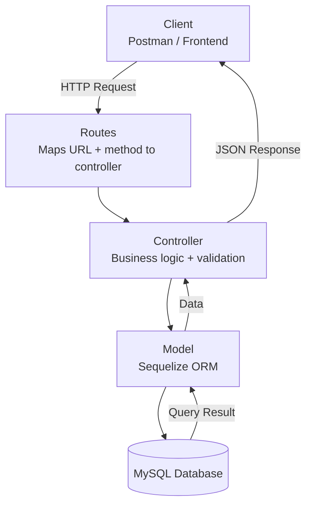

# Day 17 – MVC, APIs & JS

## 1. MVC Architecture


### The Restaurant Analogy
| In a restaurant | In your code | Its one job |
|---|---|---|
| The door & signs | **Route** | Sends you to the right place |
| The waiter | **Controller** | Takes your order, brings your food back |
| The kitchen | **Model** | Knows where the data is, prepares it |
| The plate on the table | **View (frontend)** | How it looks when you see it |

### The Golden Rule
- **The waiter never cooks** — the controller never touches raw data logic directly
- **The kitchen never walks to the table** — the model never sends a response (`res`)
- **Controller** → knows about `req` and `res` (the customer)
- **Model** → knows about `data` (the food)
- Neither one does the other's job

### In Code
```js
// routes/documents.js -> the door
router.get("/documents", documentsController.getAll);

// controllers/documentsController.js -> the waiter
getAll = async (req, res) => {
  const docs = await Document.findAll(); // ask the kitchen
  res.json(docs); // carry it back
};

// models/Document.js -> the kitchen
findAll = () => {
  return readFromFile(); // knows the data. never touches res.
};
```
-  If a controller starts reading files directly → it has walked into the kitchen (wrong)
-  If a model starts calling `res.json()` → the cook walked out to the table (wrong)

---

## 2. Backend & APIs

### The Two Halves of a Website
- **Frontend** → the part you can see and click, lives in your browser
- **Backend** → the part you cannot see, lives on a server elsewhere
- They talk through an **API** — a way to ask for something and get an answer back
- Analogy: a shop counter — you can't enter the storeroom, you ask at the counter and someone fetches it for you

### The Four Things in Every Conversation
| Word | What it really means |
|---|---|
| **Request** | You asking for something |
| **Response** | What comes back |
| **Status code** | Did it work? 200 = yes, 404 = not found, 500 = we broke |
| **JSON** | The language they both agree to speak |

### Why Postman?
- Browser address bar can only **GET** (fetch something)
- APIs can also **create**, **update**, and **delete**
- Postman lets you send all request types → GET, POST, PUT/PATCH, DELETE


---

## 3. JavaScript — Basic to Advanced

### Core Idea
- Everything in JS is just **keeping things** and **doing things to them**

### Object = a labelled box
```js
const student = { name: "Rahul", marks: 92 };
student.name; // look at the label "name" -> "Rahul"
```

### Array = a row of boxes
```js
const students = [
  { name: "Rahul", marks: 92 },
  { name: "Aman", marks: 81 },
  { name: "Riya", marks: 96 }
];
```
- This is what real data looks like: a row of users, products, orders, etc.

### Array Methods = jobs you give the row
| Method | You are saying... | You get back |
|---|---|---|
| `forEach` | "read out every name" | nothing, you just did it |
| `map` | "write me a new list of just the names" | a new row |
| `filter` | "keep only those above 90" | a smaller row |
| `find` | "bring me the one called Aman" | one box |
| `some` | "did anyone pass?" | yes or no |
| `every` | "did everyone pass?" | yes or no |
| `sort` | "line up by marks" | the row, reordered |
| `reduce` | "add all the marks into one total" | one number |

### Trick to Remember
- Ask: **"how many things do I want back?"**
  - Many → `map`, `filter`
  - One thing → `find`
  - One number → `reduce`
  - Yes/No → `some`, `every`
  - Nothing → `forEach`

---

## 4. Error Handling

### The Idea
- Error handling = deciding what happens when something goes wrong, instead of letting the app crash
- Analogy: a **seatbelt** — you don't wear it expecting to crash, you wear it so you're fine *if* you do

### try/catch — attempt, and have a plan B
```js
app.get("/api/documents/:id", async (req, res) => {
  try {
    const doc = await Document.findById(req.params.id);
    if (!doc) {
      return res.status(404).json({ error: "Not found" });
    }
    res.json(doc); // all good
  } catch (err) {
    console.error(err); // you need to know
    res.status(500).json({ error: "Something went wrong" });
  }
});
```
- **Rule 1**: Never let the server die — one bad request shouldn't crash everything
- **Rule 2**: Always answer, even if the answer is "no" — silence is the worst response

### Status Codes — Say the Right Thing
| Code | You are saying | Whose fault |
|---|---|---|
| 200 | "here you go" | nobody, it worked |
| 201 | "made it, here it is" | nobody |
| 400 | "you sent me rubbish" | theirs |
| 401 | "I don't know who you are" | theirs |
| 404 | "that thing does not exist" | theirs |
| 500 | "I broke, sorry" | yours |
- Never send `200 OK` with an error message hidden inside — that's like handing someone an empty plate and saying "enjoy your meal"

---

## 5. Backend Revision

### What the Backend Actually Is
- A program that **sits and waits** → someone asks something → it works out the answer → it replies → it waits again

### The Folders and Why
| Folder | What lives there | Restaurant equivalent |
|---|---|---|
| `routes/` | which URL goes where | the door and the signs |
| `controllers/` | takes `req`, sends `res` | the waiter |
| `models/` | knows the data | the kitchen |
| `middleware/` | runs before your route does | the security guard |

### Middleware — The Guard at the Door
- Runs **before** your route
- Can check you, log you, or turn you away
- Calls `next()` to say "fine, let them through"
```js
app.use(express.json()); // unpack JSON bodies. put me FIRST.
app.use(logger);          // write down who came in
app.use("/api", routes);  // now the actual doors
```
-  **Order matters** — if `express.json()` is placed below your routes, `req.body` will be `undefined`

### The One Sentence to Remember for Interviews
> A request comes in → the route sends it to a controller → the controller asks the model for data → the model returns it → the controller sends it back as JSON with a status code.

### The Five Words You Need
- `req` → what they sent you
- `res` → how you answer
- `route` → which door
- `controller` → who handles it
- `model` → who knows the data

---

## 6. Git & GitHub

### The Core Difference
- **Git** → the save point (lives on your laptop, remembers versions of your work)
- **GitHub** → uploading your save file online so others can see it (a website)
- Analogy: Git is saving your video game progress; GitHub is posting your save file online

### The Three Steps of Saving Work
| Command | What it does | Like... |
|---|---|---|
| `git add .` | picks which files to save | putting things in a box |
| `git commit -m "..."` | saves them, with a note | taping the box shut and labelling it |
| `git push` | sends it to GitHub | posting the box |
- Common mistake: committing and closing your laptop, thinking it's on GitHub — **nothing is on GitHub until you push**

### The Whole Workflow, In Order
```bash
# once, at the start of a new project
git init
git remote add origin https://github.com/you/your-repo.git

# every single time you do some work
git add .
git commit -m "added css styling and the 3 projects"
git push origin main
```
- Commit **often**, not just once at the end of the week
- Your commit history tells the story of how you worked

### Two More Daily Commands
- `git status` → "where am I? what have I changed?" — run when lost
- `git clone <url>` → "give me a copy of that project on my laptop"

### Writing Real Commit Messages
| Bad | Good |
|---|---|
| update | added hover states to buttons |
| asdf | fixed navbar breaking on mobile |
| final final v2 | added css.md learnings |
- Your GitHub is your **real CV** — not the PDF resume

---

## 7. Same-Origin vs Cross-Origin (CORS)

### What "Origin" Means
- Origin = **protocol + domain + port**
- All three must match to be "same-origin"; if even one differs → cross-origin
```js
https://shop.com/products   // https | shop.com | 443
https://shop.com/cart       // SAME origin (path doesn't matter)
http://shop.com             // different protocol -> CROSS
https://api.shop.com        // different domain -> CROSS
https://shop.com:3000       // different port -> CROSS
```
- Analogy: same-origin = walking between rooms in your own flat; cross-origin = knocking on a different flat's door

### Why the Browser Cares
- Protects the user — without this rule, any malicious website could quietly call your bank using your logged-in session
- The **browser** blocks cross-origin calls by default, not the server
- This is why a request can work in Postman but fail in the browser

### The Fix — CORS
- **CORS** (Cross-Origin Resource Sharing) = the server saying "it's fine, I allow this flat to knock"
```js
const cors = require("cors");
app.use(cors()); // allow any origin (fine for learning)

// or allow only your frontend (better for real apps)
app.use(cors({ origin: "https://myapp.com" }));
```

### Summary Table
| Term | In one line |
|---|---|
| Origin | protocol + domain + port, all three |
| Same-origin | all three match, always allowed |
| Cross-origin | one differs, blocked by default |
| CORS | the server's way of saying "I allow it" |

---

## Key Points to Remember
- MVC keeps responsibilities separate: routes direct, controllers handle requests, models handle data
- APIs are just structured "ask and answer" conversations using JSON and status codes
- Array methods should be chosen based on how many results you want back
- Always wrap risky code in `try/catch` and always respond with a proper status code
- Middleware order matters — `express.json()` must come first
- Git saves locally, GitHub publishes online — nothing is live until you `push`
- CORS errors are the browser protecting the user, fixed on the server side with the `cors` package

## Summary
This was a doubt-clearing session revisiting core backend and JavaScript fundamentals from the ground up — MVC architecture, API request/response cycles, JavaScript array methods, error handling with try/catch, a full backend revision, Git/GitHub basics, and same-origin vs cross-origin (CORS) rules — all explained through simple real-world analogies.