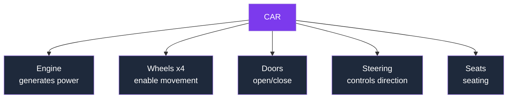
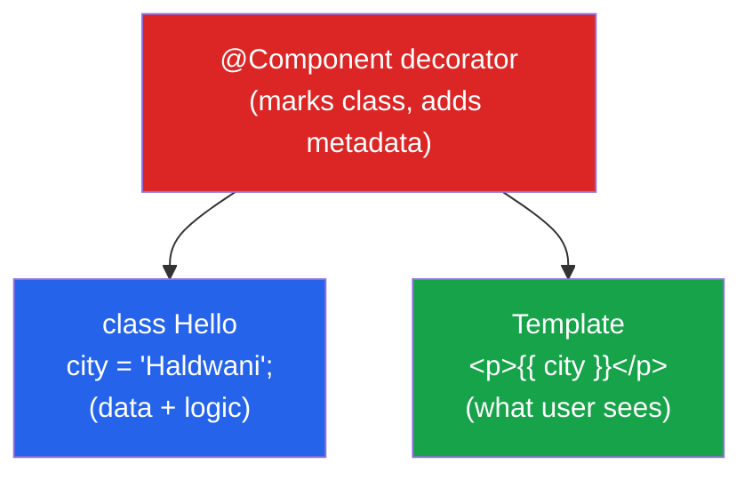
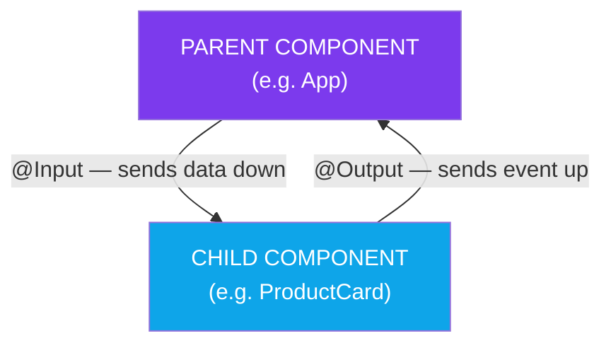
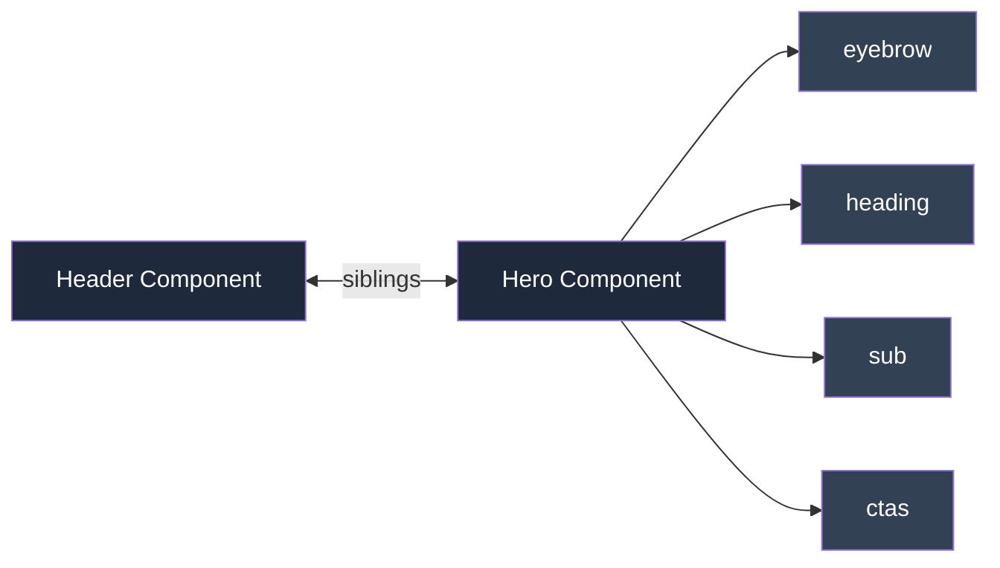

## Day 27: Angular Components & Component Communication

### 1. What is a Component? 
- A **reusable, self-contained piece of UI**
- Bundles its own **HTML** (template), **CSS** (styles), and **TypeScript** (logic) — all together

**Examples of components on a real website:**
- Header component
- Navigation component
- Login form component
- Product card component
- Footer component

### 2. The Repetition Problem (Why Components Exist)

**Without components** (repeated code):
```html
<div class="card">
  <h2>iPhone 16</h2>
  <button>Buy</button>
</div>
<div class="card">
  <h2>Samsung S25</h2>
  <button>Buy</button>
</div>
```

**With components** (one reusable piece):
```html
<product-card name="iPhone 16"></product-card>
<product-card name="Samsung S25"></product-card>
```

> Same component, different data, reused everywhere.

### 3. Why Components? (15 Advantages)

| # | Advantage |
|---|---|
| 1 | Code reusability — write once, use many times |
| 2 | Easy maintenance — fix a bug in one place |
| 3 | Better organisation — code split into manageable parts |
| 4 | Improved readability — smaller files are easier to understand |
| 5 | Faster development — reuse instead of rebuilding |
| 6 | Consistency — same look/behavior everywhere |
| 7 | Independent development — teams work in parallel |
| 8 | Easy testing — test components on their own |
| 9 | Scalability — large apps easier to build & extend |
| 10 | Encapsulation — each component manages its own logic/styles |
| 11 | Reduced duplication — no repeated HTML/CSS/JS |
| 12 | Better performance — only changed components update |
| 13 | Simpler debugging — problems isolated to one component |
| 14 | Flexible composition — complex pages built from small pieces |
| 15 | Easier collaboration — fewer conflicts between team members |

### 4. Real-World Analogy: The Car 



- Each part is **independent and reusable**
- Need a new wheel? You don't rebuild the whole car
- Same logic applies to components — swap/fix one without touching others

> **Note:** JavaScript by itself has no built-in "component" feature — this idea comes from frameworks like Angular, React, Vue, Svelte, Web Components.

### 5. What is a Component in Angular? (Technical Definition)

An Angular component = **Class + Template + Decorator**



| Part | Role |
|---|---|
| **Template** | Defines what the user sees — HTML + Angular's special syntax/bindings |
| **Class** | Holds the data (properties) and logic (methods) — written in TypeScript |
| **Decorator** (`@Component`) | Marker that adds metadata to the class, turning it into a component |

### 6. Creating a Component with the CLI
```
ng generate component hello
```
Short form:
```
ng g c hello
```
This auto-creates a folder with the component's files (`.ts`, `.html`, `.css`, `.spec.ts`)

### 7. Building a Component — Step by Step

**Step 1 — The class:**
```typescript
export class AppComponent {
  name: string = "Angular";
}
```

**Step 2 — Import the decorator:**
```typescript
import { Component } from "@angular/core";
```

**Step 3 — Apply decorator + metadata:**
```typescript
import { Component } from "@angular/core";

@Component({
  selector: "app-hello",
  template: `<h1>Hello {{ name }}</h1>`,
})
export class AppComponent {
  name: string = "Angular";
}
```

### 8. Data Binding — `{{ }}` Interpolation
```html
<h1>Hello {{ name }}</h1>
```
- Double curly braces pull the value of `name` from the class and drop it into the page
- If `name` changes, the page updates automatically

### 9. The Selector
- Custom HTML tag for a component, e.g. `app-hello`
- Wherever Angular sees `<app-hello></app-hello>`, it replaces it with the component's template
- This is **how you place a component onto a page**

### 10. Running It
```
ng serve
```
Then open: `http://localhost:4200`

---

##  Component Communication (Theory — Hands-on Next Class)

### Parent → Child: `@Input`
- Lets a **parent** component send data **down** to a **child** component
- Think: a parent handing something to their child
- Example: passing a product name into `<product-card>`

### Child → Parent: `@Output`
- Lets a **child** component send an **event** back **up** to the **parent**
- Think: a child telling the parent "hey, something happened" (like a button click)



> **Memory trick:**
> - Input = data flows **IN**, parent → child
> - Output = event flows **OUT**, child → parent

### Component Relationship Example (Header / Hero — Sibling + Child)



---

## Summary Takeaways

- **Angular** = Google's framework for fast, mobile-ready, TypeScript-based web apps
- **ECMAScript** = official JS language standard; **TypeScript** = JS + types (Microsoft)
- **CLI (`ng`)** = tool that creates, runs, builds Angular projects automatically
- **Component** = reusable UI piece = **Class + Template + Decorator**
- **15 advantages** of components: reusability, maintenance, consistency, testing, scalability, etc.
- **Data binding** `{{ }}` connects class data to the template
- **Selector** places a component on a page like a custom HTML tag
- **@Input** (parent→child) and **@Output** (child→parent) enable component communication

