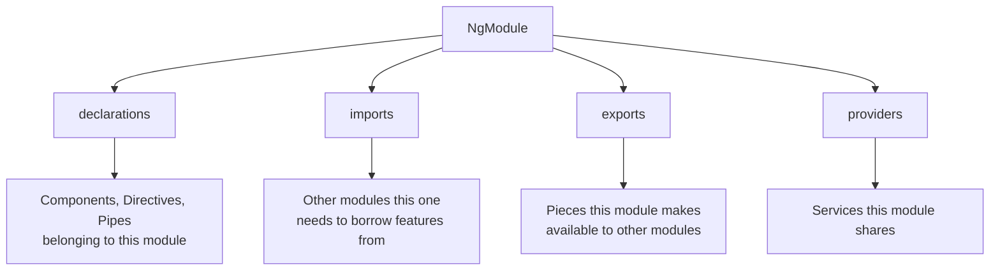
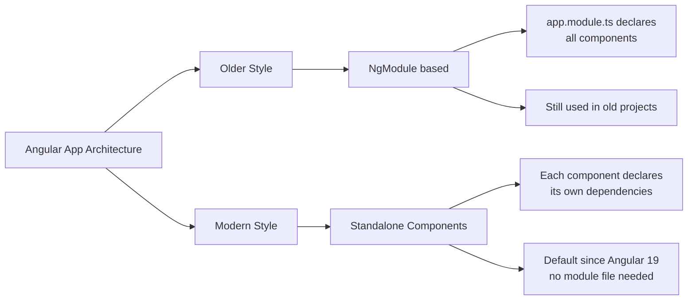
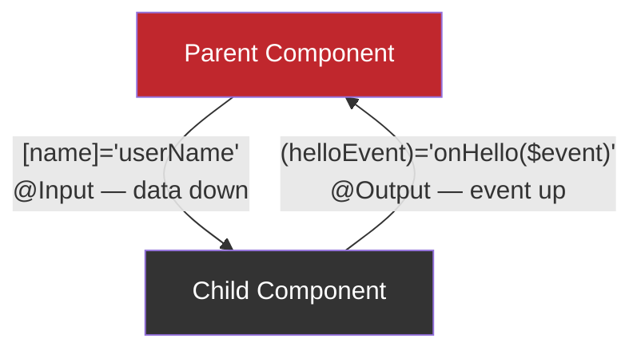
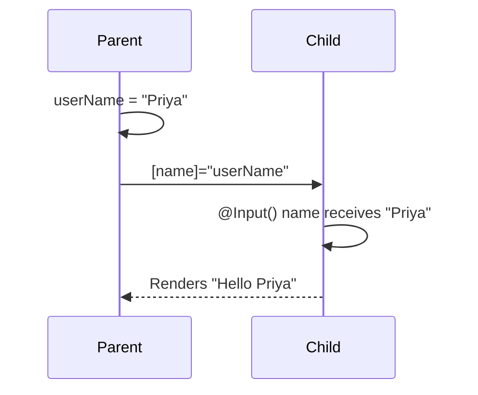
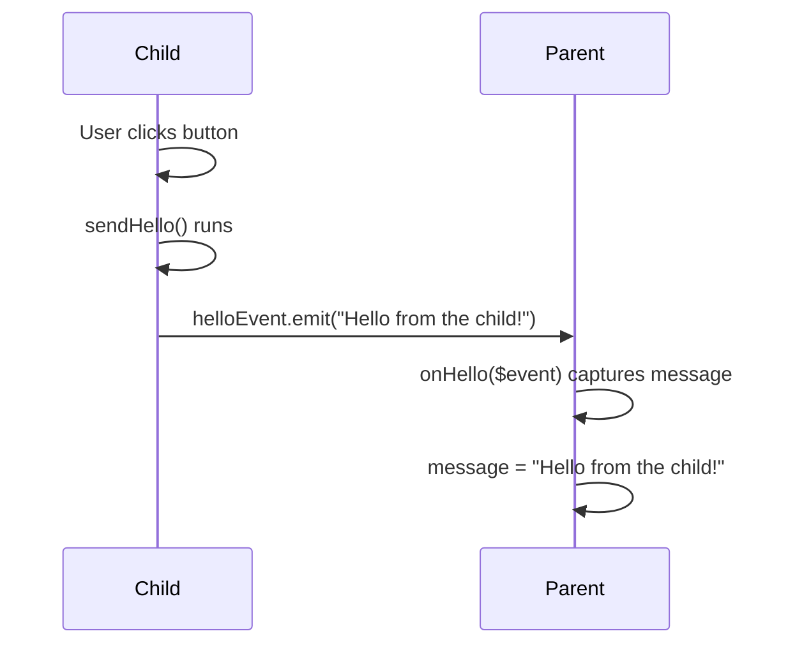

# Day 28 — Angular Modules & Component Communication (Theory)

##  Topics Covered
1. What an Angular Module (NgModule) is
2. Why modules exist
3. How a module looks in code
4. Why modules are now optional (standalone components)
5. Component Communication — Parent to Child (`@Input`)
6. Component Communication — Child to Parent (`@Output`)
7. Brackets cheat sheet

---

## 1. What is an Angular Module?

**Simple analogy:** Think of a module as a **labeled folder**. As your app grows and you have many components, you need a way to keep them organized — like putting related files into one folder instead of scattering them everywhere.

An Angular Module (written as `NgModule`) is Angular's original way of grouping related components, directives, and pipes together, and declaring what they need to work.

**Example:** A shopping app might have:
- `UserModule` — everything related to users
- `ProductModule` — everything related to products
- `CartModule` — everything related to the cart

### What a module holds (4 key parts)
| Part | Meaning |
|---|---|
| `declarations` | The components, directives, and pipes that belong to this module |
| `imports` | Other modules this one needs to borrow features from |
| `exports` | The pieces this module makes available to other modules |
| `providers` | The services this module shares |

---
##  Diagram : What a Module Holds




## 2. Why Modules Exist (The Purpose)

Modules solve a real problem: in a big app, Angular needs to know **which components exist**, **what they depend on**, and **how to load them efficiently**. Modules give Angular that map.

Point-wise reasons:
- **Organisation** — group related features instead of one giant messy pile of files
- **Reusability** — a well-made module can be reused across different projects
- **Separation of concerns** — each feature lives in its own module, independent of others
- **Lazy loading** — load a feature's module only when the user actually visits that part of the app, so the app starts faster
- **Shared setup** — declare common things (shared components/services) in one place

---

## 3. How a Module Looks in Code

A module is a class marked with the `@NgModule` decorator — similar to how a component uses `@Component`.

```typescript
// app.module.ts (the older module style)
import { NgModule } from "@angular/core";
import { BrowserModule } from "@angular/platform-browser";
import { AppComponent } from "./app.component";

@NgModule({
  declarations: [AppComponent], // components in this module
  imports: [BrowserModule],     // modules it needs
  bootstrap: [AppComponent],    // the root component to start with
})
export class AppModule {}
```

If you open an older Angular project, `app.module.ts` is usually the first file that runs — it tells Angular which components exist and which one to start the app with.

---

## 4. Important: Modules Are Now Optional

**Key point to remember:** Modern Angular has moved to **standalone components**, where each component declares what it needs on its own — no module file required.

- Since Angular 19, new projects created with `ng new` are standalone by default and often have **no module file at all**.

### Where does that leave modules?
- **Still fully supported** — old apps run fine, and you'll meet modules a lot in real jobs
-  **Not the default for new code** — new projects use standalone components
-  **Still useful sometimes** — mainly when using an older third-party library that is built as a module

**Takeaway:** Learn modules so you can read/maintain the millions of existing Angular apps using them. For your own new work (like ResumeFlow), standalone is the modern way.

---
##  Diagram : Modules vs Standalone (The Shift)



## 5. Component Communication: Parent & Child
##  Diagram : The Big Picture — Full Communication Cycle




**Simple analogy:** When one component's tag sits *inside* another's template, the outer one is the **parent** and the inner one is the **child** — like a parent holding a child's hand.

Data flows two ways, each with its own tool:
- **Parent → Child**: parent sends data down using `@Input`
- **Child → Parent**: child sends an event up using `@Output`

---

## 6. Sending Data Down: `@Input`

The child marks a property with `@Input()`, meaning "a parent may set this."

```typescript
// The Child
import { Component, Input } from "@angular/core";

@Component({
  selector: "app-child",
  template: `<h3>Hello {{ name }}</h3>`,
})
export class ChildComponent {
  @Input() name: string = "";
}
```
##  Diagram : Parent → Child Data Flow (@Input)




---

The parent passes a value in using **square brackets**:

```typescript
// The Parent
template: `<app-child [name]="userName"></app-child>`

// in the class:
userName: string = "Priya";
```

**Result:** The child shows "Hello Priya." The parent's `userName` flowed down into the child's `name`.

>  `[name]` means "bind to a value," not literal text.

---

## 7. Sending News Up: `@Output`

The child raises an event with `@Output` and an `EventEmitter`, and the parent listens.

```typescript
// The Child
import { Component, Output, EventEmitter } from "@angular/core";

@Component({
  selector: "app-child",
  template: `<button (click)="sendHello()">Say hello</button>`,
})
export class ChildComponent {
  @Output() helloEvent = new EventEmitter<string>();

  sendHello() {
    this.helloEvent.emit("Hello from the child!");
  }
}
```

```typescript
// The Parent
template: `<app-child (helloEvent)="onHello($event)"></app-child>`

onHello(text: string) {
  this.message = text; // "Hello from the child!"
}
```

**Result:** Click the button → the parent catches the event with `(helloEvent)`. The special keyword `$event` carries whatever the child emitted.

---
##  Diagram : Child → Parent Event Flow (@Output)




---

## 8. The Two Brackets, Side by Side

| Syntax | Direction | Meaning |
|---|---|---|
| `[name]="value"` | Parent → Child | Pass data down into an `@Input` |
| `(event)="handler()"` | Child → Parent | Listen for an `@Output` event coming up |

**Easy way to remember:**
- Square brackets `[ ]` look like a **box** you put something into → **data in**
- Round brackets `( )` look like an **ear** listening for something → **event out**

---

## 9. Key Takeaways (Remember This)

- A **module (NgModule)** groups related components and declares what they need. Purpose: organisation, reusability, separation, lazy loading.
- **Modules are now optional** — modern Angular uses standalone components by default. Learn modules to read old code; use standalone for new code.
- **`@Input`** sends data down, parent to child. Use `[prop]="value"`.
- **`@Output`** sends an event up, child to parent. Use `(event)="handler($event)"` with an `EventEmitter`.
- **Brackets:** `[ ]` = data in, `( )` = event out.

---


