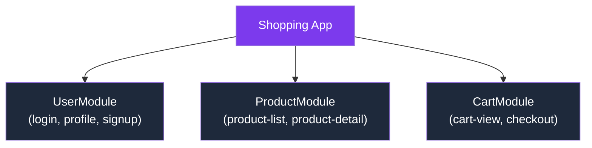
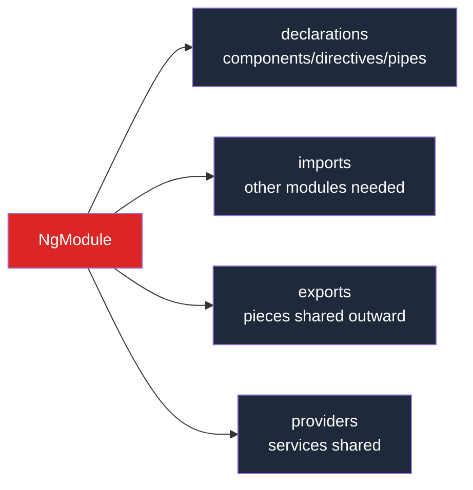
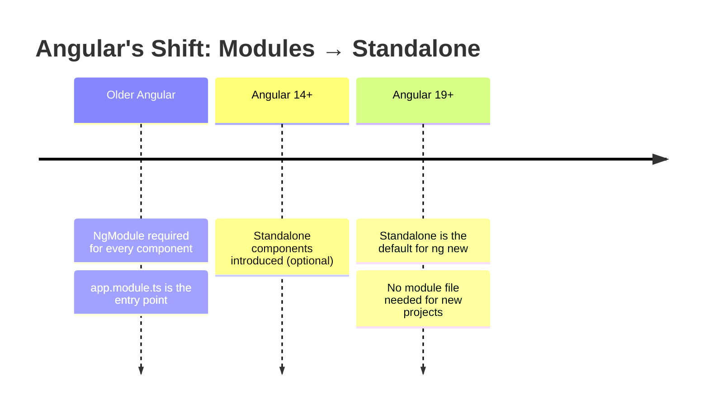
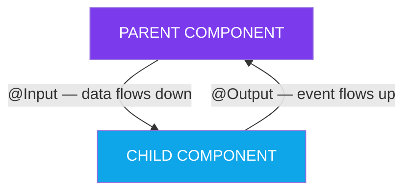
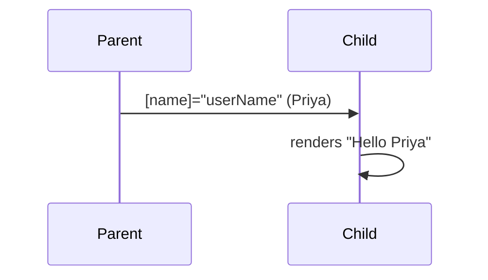
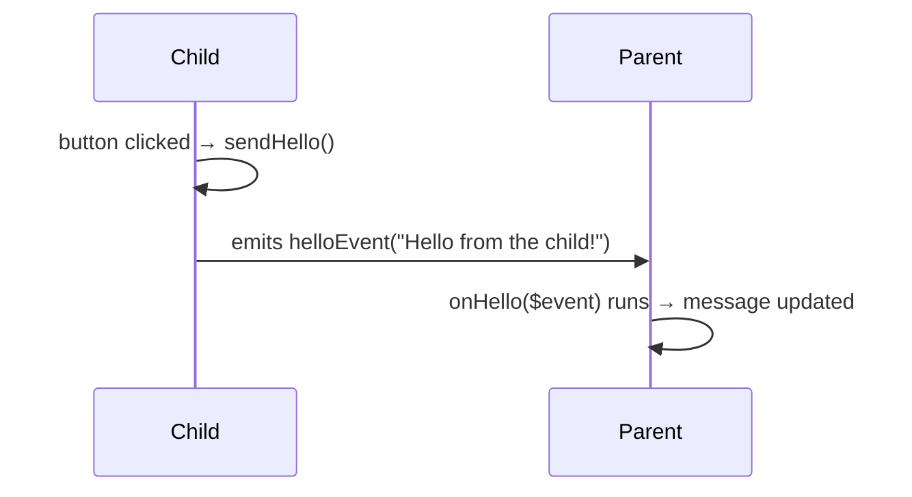
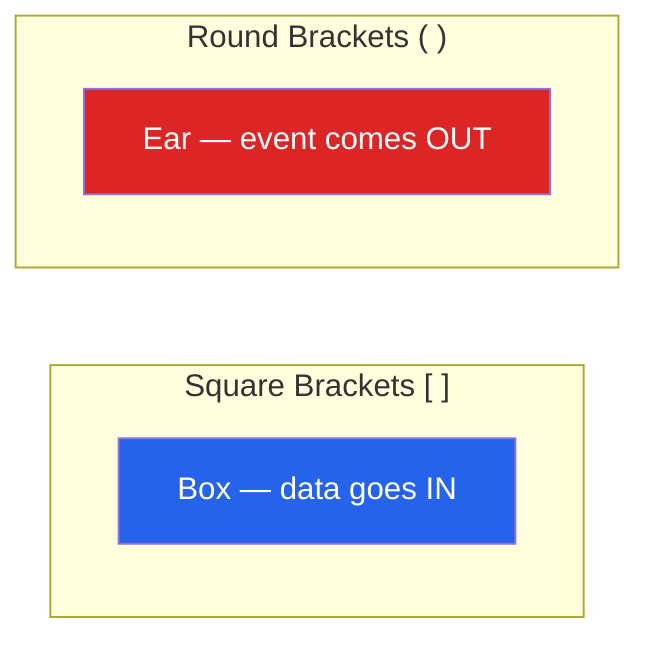

# Day 28 — Angular Modules & Component Communication 


---

##  Table of Contents
1. [What is an Angular Module?](#what-is-an-angular-module)
2. [What a Module Holds](#what-a-module-holds)
3. [Why Modules Exist](#why-modules-exist)
4. [How a Module Looks](#how-a-module-looks)
5. [Modules Are Now Optional](#modules-are-now-optional)
6. [Component Communication — The Parent/Child Idea](#component-communication--the-parentchild-idea)
7. [@Input — Sending Data Down](#input--sending-data-down)
8. [@Output — Sending Events Up](#output--sending-events-up)
9. [Brackets Cheat Sheet](#brackets-cheat-sheet)


---

## What is an Angular Module?

- As an app grows, you get **many components** — you need a way to keep them organised
- An **Angular Module** (`NgModule`) was Angular's **original** way to do this
- It's a **box that groups related components, directives, and pipes together**, and declares what they need to work

> **Analogy:** Think of a module as a **labeled folder** — "these components belong together, here's what they share, here's what they let the rest of the app use."

**Example:** A shopping app might have:
- `UserModule`
- `ProductModule`
- `CartModule`

Each holding its own related pieces.



---

## What a Module Holds

| Property | Meaning |
|---|---|
| **declarations** | The components, directives, and pipes that belong to this module |
| **imports** | Other modules this one needs to borrow features from |
| **exports** | The pieces this module makes available to other modules |
| **providers** | The services this module shares |



---

## Why Modules Exist

Modules were created to solve a real problem: in a big app, the framework needs to know **which components exist, what they depend on, and how to load them efficiently.** Modules gave Angular that map.

| Reason | Explanation |
|---|---|
| **Organisation** | Group related features so the codebase isn't one giant pile |
| **Reusability** | A well-made module can be reused across projects |
| **Separation of concerns** | Each feature lives in its own module, independent of others |
| **Lazy loading** | Load a feature's module only when the user actually visits it — app starts faster |
| **Shared setup** | Declare common things (shared components/services) in one place |

---

## How a Module Looks

A module is a **class marked with the `@NgModule` decorator** — similar to how a component uses `@Component`.

**`app.module.ts` (the older module style):**
```typescript
import { NgModule } from "@angular/core";
import { BrowserModule } from "@angular/platform-browser";
import { AppComponent } from "./app.component";

@NgModule({
  declarations: [AppComponent],   // components in this module
  imports: [BrowserModule],       // modules it needs
  bootstrap: [AppComponent],      // the root component to start with
})
export class AppModule {}
```

> If you open an older Angular project, `app.module.ts` is the **first file that runs** — it tells Angular which components exist and which one to start the app with.

---

## Modules Are Now Optional

**Important point to remember:** Modern Angular has moved to **standalone components**, where each component declares what it needs on its own — no module file required.

- Since **Angular 19**, new projects created with `ng new` are **standalone by default** and often have **no module file at all**

### Where does that leave modules?

| Status | Explanation |
|---|---|
|  **Still fully supported** | Angular keeps modules working — older apps run fine, and you'll meet them in real jobs |
|  **Not the default for new code** | When starting something fresh today, standalone components are used |
| **Still useful sometimes** | Mainly when using an older third-party library built as a module |



> **Takeaway:** Understand modules so you can **read and maintain** the millions of existing Angular apps that use them. But for **your own new work**, standalone is the modern way.

---

## Component Communication — The Parent/Child Idea

Real apps have many components, and they must **talk to each other**. When one component's tag sits **inside** another's template, the outer one is the **parent** and the inner one is the **child**.

**Data flows two ways, each with its own tool:**



| Direction | Tool |
|---|---|
| **Parent → Child** | Parent sends data down using `@Input` |
| **Child → Parent** | Child sends an event up using `@Output` |

---

## @Input — Sending Data Down

The **child** marks a property with `@Input()`, meaning "a parent may set this":

**The Child:**
```typescript
import { Component, Input } from "@angular/core";

@Component({
  selector: "app-child",
  template: `<h3>Hello {{ name }}</h3>`,
})
export class ChildComponent {
  @Input() name: string = "";
}
```

**The Parent** passes a value in with **square brackets**:
```typescript
template: `<app-child [name]="userName"></app-child>`
// in the class:
userName: string = "Priya";
```

**Result:** The child shows **Hello Priya**. The parent's `userName` flowed down into the child's `name`.

> `[name]` means **"bind to a value"**, not the literal text.



---

## @Output — Sending Events Up

The **child** raises an event with `@Output` and an `EventEmitter`, and the **parent** listens:

**The Child:**
```typescript
import { Component, Output, EventEmitter } from "@angular/core";

@Component({
  selector: "app-child",
  template: `<button (click)="sendHello()">Say hello</button>`,
})
export class ChildComponent {
  @Output() helloEvent = new EventEmitter<string>();

  sendHello() {
    this.helloEvent.emit("Hello from the child!");
  }
}
```

**The Parent:**
```typescript
template: `<app-child (helloEvent)="onHello($event)"></app-child>`

onHello(text: string) {
  this.message = text;  // "Hello from the child!"
}
```

**Result:** Click the button → the parent catches the event with `(helloEvent)`. The special word **`$event`** carries whatever the child emitted.



---

## Brackets Cheat Sheet

| Syntax | Direction | Meaning |
|---|---|---|
| `[name]="value"` | Parent → Child | Pass data down into an `@Input` |
| `(event)="handler()"` | Child → Parent | Listen for an `@Output` event coming up |

> **Easy way to remember:**
> - Square brackets `[ ]` look like a **box you put something into** → data in
> - Round brackets `( )` look like an **ear listening** for something → event out



---

## Summary

- **NgModule** groups related components and declares what they need — purpose: organisation, reusability, separation, lazy loading
- **Modules are now optional** — modern Angular uses standalone components by default. Learn modules to read old code, use standalone for new code
- **`@Input`** sends data down, parent → child. Use `[prop]="value"`
- **`@Output`** sends an event up, child → parent. Use `(event)="handler($event)"` with an `EventEmitter`
- **Brackets:** `[ ]` = data in, `( )` = event out

---

