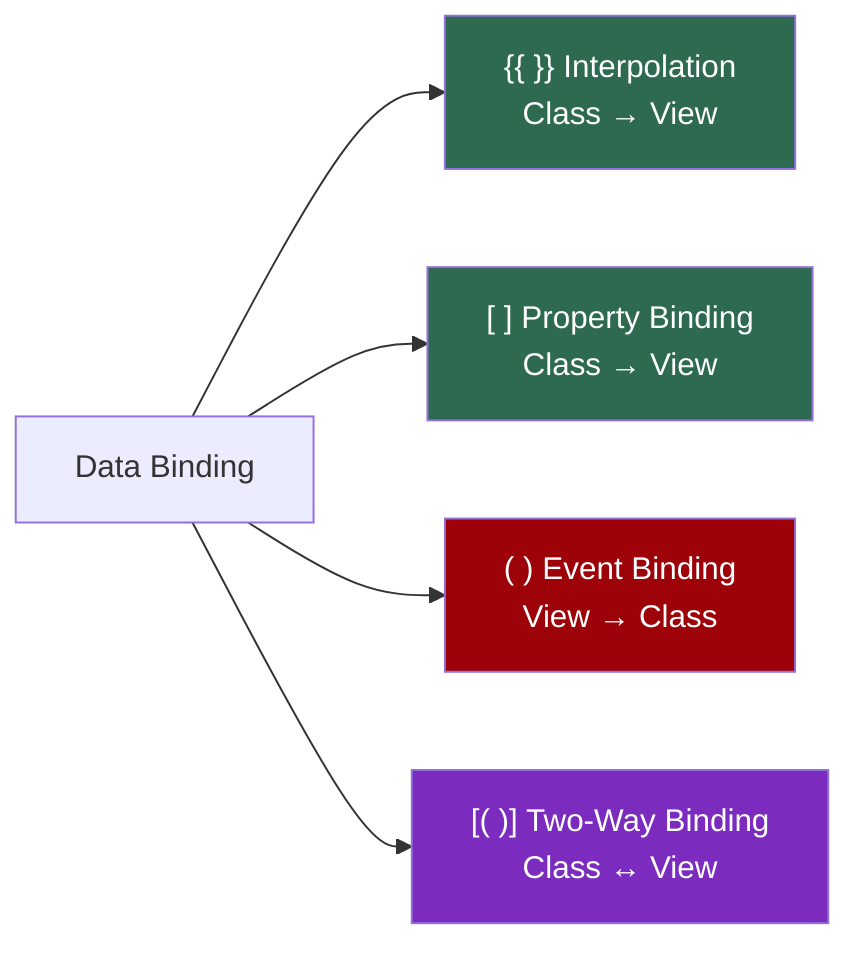
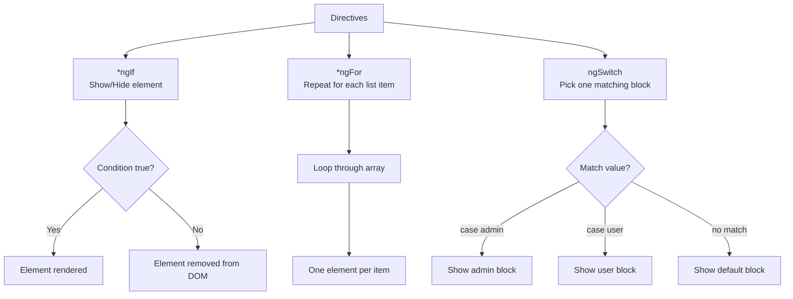
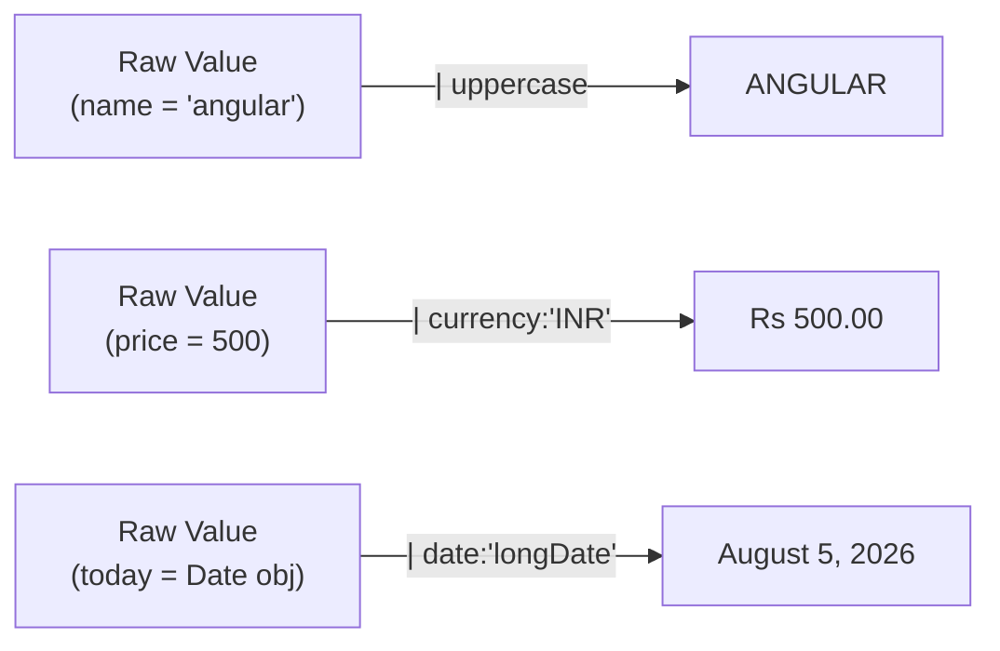
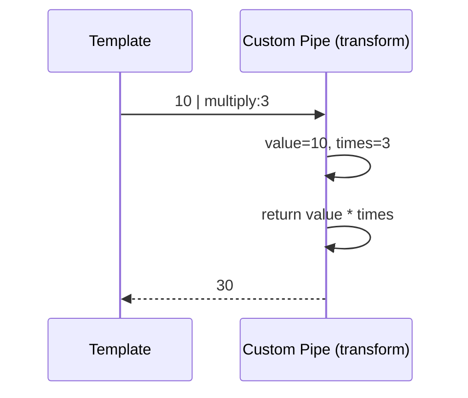

# Day 29 — Binding, Directives & Pipes

##  Topics Covered
1. Data Binding — the four kinds
2. Directives — `*ngIf`, `*ngFor`, `ngSwitch`
3. Pipes — formatting values for display
4. Custom Pipes — building your own

---

## 1. Data Binding: The Four Kinds

**Simple idea:** Binding connects your **class** (the data) to your **template** (the view the user sees). There are four kinds, and the brackets tell you the direction of the connection.

### Interpolation `{{ }}`
Shows a value from the class in the page. **Class → View, read only.**

```html
<h1>Hello {{ name }}</h1>
<!-- class: name = "Angular"; -> shows "Hello Angular" -->
```

###  Property Binding `[ ]`
Sets an element's property from a class value. Also **class → view**.

```html

<button [disabled]="isBusy">Save</button>
```

> `[src]` takes its value from the `imageUrl` property in the class.
> **Difference to remember:** `{{ }}` puts text *between* tags, `[ ]` sets a *property* on the tag.

###  Event Binding `( )`
Runs a class method when something happens, like a click. **View → Class.**

```html
<button (click)="save()">Save</button>
```
```typescript
// class:
save() { console.log("saved!"); }
```

###  Two-Way Binding `[( )]`
Connects an input box to a class property **both ways at once**. Type in the box → property updates. Change the property → box updates.

The `[()]` shape is nicknamed **"banana in a box."**

```html
<input [(ngModel)]="username" />
<p>You typed: {{ username }}</p>
```

>  **Note:** Two-way binding with `ngModel` needs `FormsModule`.
> - In an older module project → add it to the module's `imports`
> - In a standalone component → add `FormsModule` to the component's `imports`

###  The Four, In One Look
| Syntax | Action |
|---|---|
| `{{ }}` | Show a value |
| `[ ]` | Set a property |
| `( )` | Handle an event |
| `[( )]` | Both ways (two-way) |

**Memory trick:** Square = data in · Round = event out · Both together = two-way.



---

## 2. Directives: `*ngIf`, `*ngFor`, `ngSwitch`

**Simple idea:** Directives are special instructions placed on an element to change how it behaves.

### `*ngIf` — Show or Hide
Shows an element only if a condition is true. If false, the element is **not on the page at all** (not just hidden).

```html
<p *ngIf="isLoggedIn">Welcome back!</p>
<p *ngIf="!isLoggedIn">Please log in.</p>
```

### `*ngFor` — Loop Over a List
Repeats an element once for each item in an array. This is how you display lists.

```html
<ul>
  <li *ngFor="let fruit of fruits">{{ fruit }}</li>
</ul>
```
```typescript
// class: fruits = ["Apple", "Mango", "Banana"];
```
Angular creates one `<li>` per fruit. Three fruits → three list items. Change the array, the list changes with it.

### `ngSwitch` — Pick One of Many
Shows one block out of several, based on a value — like a switch statement in the template.

```html
<div [ngSwitch]="role">
  <p *ngSwitchCase="'admin'">You are an admin</p>
  <p *ngSwitchCase="'user'">You are a user</p>
  <p *ngSwitchDefault>Unknown role</p>
</div>
```
If `role` is `"admin"`, only the first line shows. If it matches nothing, the default shows.



---

## 3. Pipes: Format a Value for Display

**Simple idea:** A pipe transforms a value in the template **without changing the original data**. Used with the `|` symbol. Great for formatting dates, text, numbers, currency.

```html
<p>{{ name | uppercase }}</p>            <!-- ANGULAR -->
<p>{{ price | currency:'INR' }}</p>      <!-- Rs 500.00 -->
<p>{{ today | date:'longDate' }}</p>     <!-- August 5, 2026 -->
```

**Built-in pipes to know:**
`uppercase` · `lowercase` · `titlecase` · `date` · `currency` · `number` · `percent` · `json` · `slice`

**Chaining pipes** — you can stack multiple pipes together:
```html
{{ name | slice:0:5 | uppercase }}
```



---

## 4. Custom Pipes: Make Your Own

When no built-in pipe does what you want, write your own. A pipe is a **class** with the `@Pipe` decorator and a `transform` method that takes a value and returns the changed value.

```typescript
// double.pipe.ts
import { Pipe, PipeTransform } from "@angular/core";

@Pipe({ name: "double" })
export class DoublePipe implements PipeTransform {
  transform(value: number): number {
    return value * 2;
  }
}
```

**Using it in a template:**
```html
<p>{{ 10 | double }}</p> <!-- shows 20 -->
```

> The `transform` method receives the value on the left of `|`, processes it, and returns the result. Here `10` comes in, `20` goes out.
> You can also scaffold a pipe with the CLI: `ng generate pipe double`

### Pipes with Arguments
A pipe can accept arguments, written after a colon:

```typescript
@Pipe({ name: "multiply" })
export class MultiplyPipe implements PipeTransform {
  transform(value: number, times: number): number {
    return value * times;
  }
}
```

```html
<!-- template -->
<p>{{ 10 | multiply:3 }}</p> <!-- shows 30 -->
```



---

## 5. Key Takeaways 

- **Binding, four kinds:** `{{ }}` show a value · `[ ]` set a property · `( )` handle an event · `[( )]` two-way with `ngModel`
- **`*ngIf`** shows or hides · **`*ngFor`** loops over a list · **`ngSwitch`** picks one block of many
- **Pipes** format a value for display with `|`, without changing the original data
- **Custom pipe:** a class with `@Pipe` and a `transform` method that returns the changed value

---


##  Notes to Self
- Two-way binding (`[(ngModel)]`) needs `FormsModule` imported — since ResumeFlow uses standalone components, this goes in the component's own `imports` array, not a module.
- `*ngFor` and `*ngIf` will be directly useful for the dashboard's document list and pipeline section in ResumeFlow.
- Custom pipes could be handy later for formatting resume data (e.g., a pipe to format dates or truncate long text on resume cards).