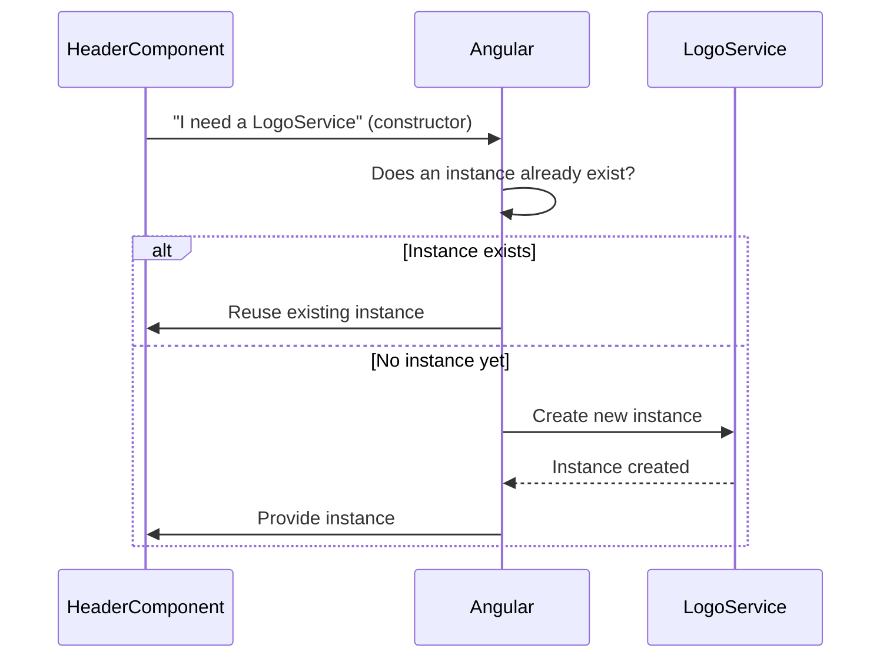
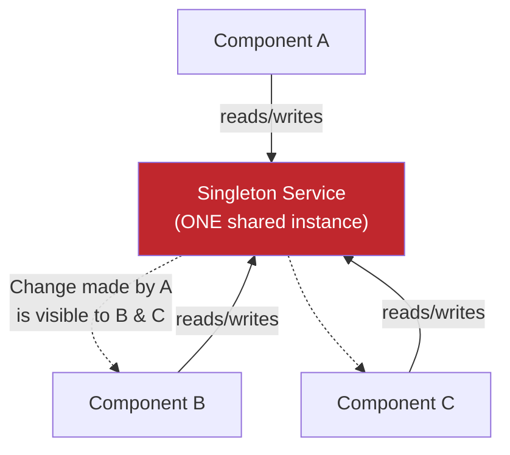
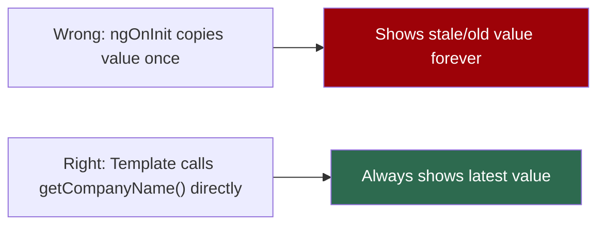

# Day 30 — Services, Singletons & Pipes

##  Topics Covered
1. What an Angular Service is
2. Dependency Injection (DI) — how a component gets a service
3. Singleton — one shared instance (with 3 real-life examples)
4. Sharing data through a singleton (and the common mistake to avoid)
5. Why we learn Angular 13, not 22
6. Pipes — built-in formatting
7. Custom Pipes — building your own

---

## 1. What is an Angular Service?

**Simple idea:** A service is a plain class that holds logic or data you want to **share across components**. Fetching from an API, storing the logged-in user, holding a company name many components display — this belongs in a service, not copied inside every component.

> **One-liner to remember:** Components are for the view. Services are for the shared work. Keep components light, put reusable logic in services.

A service is a class marked with `@Injectable`. The CLI generates one with `ng generate service logo`:

```typescript
// logo.service.ts
import { Injectable } from "@angular/core";

@Injectable({ providedIn: "root" })
export class LogoService {
  companyName = "Resume Loop";

  getCompanyName() { return this.companyName; }
  setCompanyName(name: string) { this.companyName = name; }
}
```

- `@Injectable` marks the class as injectable
- `providedIn: "root"` makes it available across the **whole app**

---

## 2. Dependency Injection (DI): How a Component Gets a Service

**Key rule:** A component does **not** build the service itself. It *asks* for it in the constructor, and Angular hands it over. This is called **Dependency Injection (DI)**.

```typescript
// header.component.ts
import { Component } from "@angular/core";
import { LogoService } from "./logo.service";

@Component({
  selector: "app-header",
  template: `
    <h1>{{ logoService.getCompanyName() }}</h1>
    <button (click)="logoService.setCompanyName('Snapied')">Change</button>
  `,
})
export class HeaderComponent {
  constructor(public logoService: LogoService) {}
}
```

The line `public logoService: LogoService` says *"I need a LogoService."* Angular creates it (or reuses the existing one) and passes it in. **You never write `new LogoService()` yourself.**

>  **Analogy:** You don't build your own electricity generator at home — you just plug into the socket and the supply is provided. DI works the same way: the component plugs in and asks, Angular provides.



---

## 3. Singleton: One Shared Instance

When a service is `providedIn: "root"`, Angular creates **exactly one** instance for the whole app, and gives that **same one** to everybody who asks. This one shared instance is called a **singleton**.

**Why it matters:** Since everyone shares the same instance, if one component changes a value, **every other component sees the change**.

###  Three Everyday Examples

| Example | Explanation |
|---|---|
| **TV Remote** | One remote, shared by the whole family. Papa changes to cricket → everyone sees cricket. Sister changes to cartoons → everyone sees cartoons. No secret second remote. |
| **Washing Machine** | One machine, shared by a small family. Mother starts a load, son later uses the *same* machine in whatever state it was left. No separate machines appear for each person. |
| **Shopping Cart** | One cart while walking through a mall. Shirt in one shop, shoes in another, toy in a third — at billing, the cart holds everything from every shop. Same cart the whole time. |

**The opposite (for contrast):** If everyone had their own remote, own washing machine, own cart — nothing would be shared. Change one, and the others know nothing. That's what it's like **without** a singleton.



---

## 4. Sharing Data Through the Singleton

**The payoff:** Two components that are **not** parent and child can still share data through the service, because they both get the same singleton.

```typescript
// Header changes it:
this.logoService.setCompanyName("Snapied");

// Footer reads it (in its template):
<p>{{ logoService.getCompanyName() }}</p> // shows "Snapied"
```

###  Common Mistake to Avoid
If a component copies the value into its own property **once** in `ngOnInit`, it will show the **old value forever**, because it only read it once.

 **Fix:** Read it directly in the template with `logoService.getCompanyName()` so it always shows the latest.

>  **Think:** Don't photograph the whiteboard once — keep looking at the board.



---

## 5. Why Angular 13, Not 22?

**Fair question, honest reasons:**

- **Core ideas are the same** — components, services, DI, pipes, modules work the same way across versions. What you learn on 13 carries straight over.
- **Most real jobs run older versions** — companies don't upgrade every year. Many live Angular apps you'll work on use older versions.
- **13 is stable and well documented** — years of tutorials, answers, and examples exist.
- **Fewer moving parts for learning** — newer versions add standalone components, signals, etc. Powerful, but confusing for a first course.

> **Takeaway:** Learn strong fundamentals on a stable version first. Moving to Angular 22 later is a small jump once basics are solid. 13 isn't "old" — the thinking is exactly the same.

---

## 6. Pipes: Format a Value for Display

A pipe changes how a value **looks** in the template, without changing the real data. Used with the `|` symbol.

```html
<p>{{ name | uppercase }}</p>            <!-- RESUME LOOP -->
<p>{{ price | currency:'INR' }}</p>      <!-- Rs 500.00 -->
<p>{{ today | date:'longDate' }}</p>     <!-- August 7, 2026 -->
```

**Common built-in pipes:** `uppercase` · `lowercase` · `titlecase` · `date` · `currency` · `number` · `percent` · `json` · `slice`

**Chaining:** `{{ name | slice:0:5 | uppercase }}`

---

## 7. Custom Pipes: Make Your Own

When no built-in pipe does what you need, write one. A pipe is a class with the `@Pipe` decorator and a `transform` method that takes a value and returns the changed value.

```typescript
// double.pipe.ts
import { Pipe, PipeTransform } from "@angular/core";

@Pipe({ name: "double" })
export class DoublePipe implements PipeTransform {
  transform(value: number): number {
    return value * 2;
  }
}
```

```html
<!-- using it -->
<p>{{ 10 | double }}</p> <!-- shows 20 -->
```

> The `transform` method takes the value on the left of `|`, processes it, returns the result. Here `10` comes in, `20` goes out.
> Generate one with the CLI: `ng generate pipe double`
>  **Angular 13 note:** Remember to add the pipe to your module's `declarations`.

**Pipes with arguments:**
```typescript
@Pipe({ name: "multiply" })
export class MultiplyPipe implements PipeTransform {
  transform(value: number, times: number): number {
    return value * times;
  }
}
```
```html
<p>{{ 10 | multiply:3 }}</p> <!-- shows 30 -->
```

---

## 8. Key Takeaways 

- **Service:** a class for shared logic and data. `@Injectable` with `providedIn: "root"`.
- **Dependency injection:** ask for a service in the constructor, Angular provides it. Never write `new`.
- **Singleton:** one shared instance for the whole app — like one TV remote, one washing machine, one mall cart. Change it in one place, everyone sees it.
- **Why Angular 13:** core ideas identical across versions, most jobs use older versions, stable base is easier to learn on.
- **Pipes:** format a value in the template with `|`. Built-in ones like `uppercase` and `date`, or write your own with `@Pipe` and `transform`.

---


##  Notes to Self
- The singleton pattern is exactly how `AuthService` works in ResumeFlow — it's already injected across login, register, and the dashboard, all sharing the same logged-in user state.
- The `ngOnInit` mistake warning is relevant — double-check ResumeFlow components aren't caching stale user/token data instead of reading it live from the service.
- Next class: **Forms in Angular** — directly relevant since ResumeFlow's login/register/forgot-password forms will likely move from manual handling to Angular's Forms module.