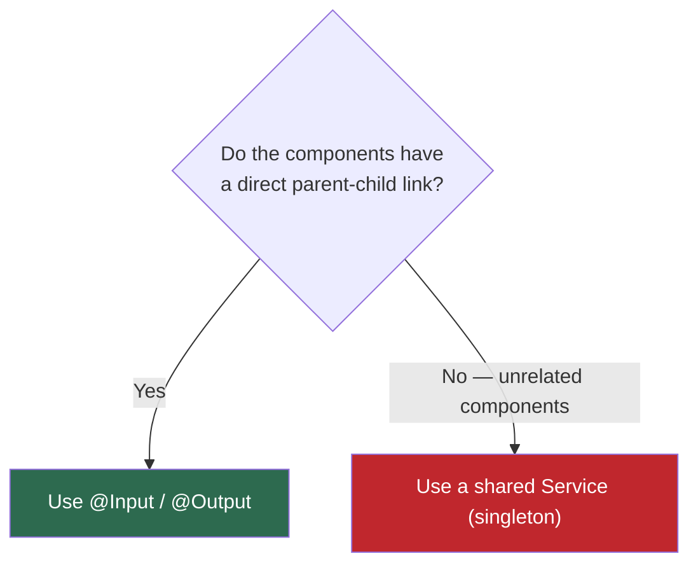
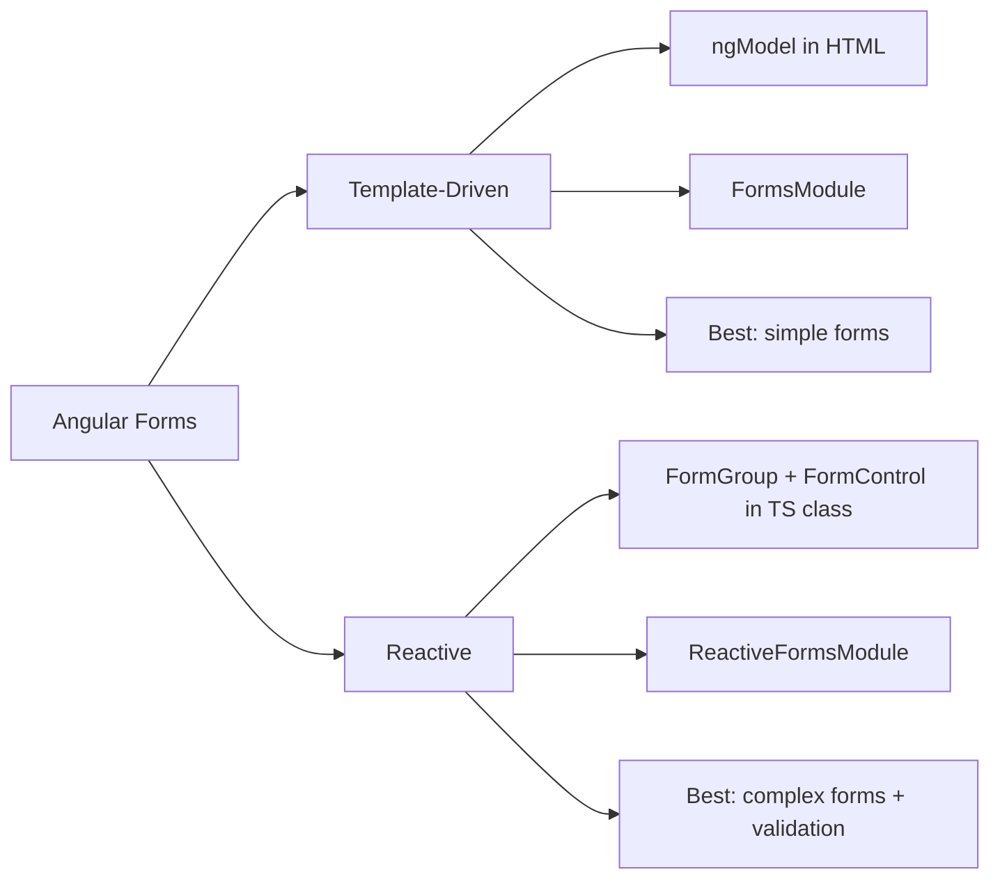
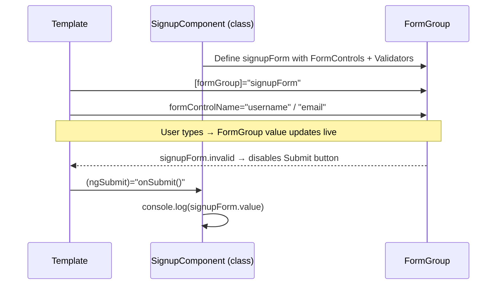

# Day 31 — Services, Data Sharing & Forms

## Topics Covered
1. Service — quick recap (shared logic & data)
2. Making a Service
3. Dependency Injection — recap
4. Singleton & Data Sharing — recap + when to use @Input/@Output vs a Service
5. Forms — the two approaches in Angular
6. Template-Driven Forms
7. Reactive Forms
8. Validation

---

## 1. What is a Service? 

**Simple idea:** A service is a plain class that holds logic or data you want to **reuse across components**. Fetching from an API, storing the logged-in user, a calculation many places need — all of this belongs in a service, not repeated inside each component.

> **One-liner:** Components are for the view, services are for the shared work. Keep components light, put reusable logic in services.

---

## 2. Making a Service

A service is a class marked with `@Injectable`. The CLI makes one: `ng generate service data`

```typescript
// data.service.ts
import { Injectable } from "@angular/core";

@Injectable({ providedIn: "root" })
export class DataService {
  private message: string = "Hello from the service";

  getMessage(): string { return this.message; }
  setMessage(newMessage: string): void { this.message = newMessage; }
}
```

- `@Injectable` marks the class as injectable
- `providedIn: "root"` makes it available across the **whole app**

---

## 3. Dependency Injection (DI): Recap

A component does **not** create the service itself. It asks for it in the constructor, and Angular hands it over.

```typescript
// hello.component.ts
import { Component, OnInit } from "@angular/core";
import { DataService } from "./data.service";

@Component({ selector: "app-hello", template: `<p>{{ text }}</p>` })
export class HelloComponent implements OnInit {
  text: string = "";

  constructor(private dataService: DataService) {}

  ngOnInit() {
    this.text = this.dataService.getMessage();
  }
}
```

`private dataService: DataService` says *"I need a DataService."* Angular creates it (or reuses the existing one) and passes it in. **You never write `new DataService()` yourself.**

---

## 4. Singleton & Data Sharing (Recap)

When `providedIn: "root"`, Angular makes **one instance** for the whole app, shared by everybody. If one component changes a value in the service, **every other component sees it**.

```typescript
// Component A writes:
this.dataService.setMessage("Updated by A");

// Component B reads:
this.text = this.dataService.getMessage(); // "Updated by A"
```

###  When to Use What

| Situation | Tool |
|---|---|
| Directly connected parent and child | `@Input` / `@Output` |
| Components anywhere in the app that need to share data | **Service** (singleton) |



---

## 5. Forms: Two Ways to Handle Input

Almost every app has forms: login, signup, search. Angular gives you **two ways** to build them.

| | Template-Driven | Reactive |
|---|---|---|
| **Where logic lives** | Mostly in the HTML template | Mostly in the TypeScript class |
| **Module needed** | `FormsModule` | `ReactiveFormsModule` |
| **Best for** | Simple, small forms | Bigger forms, complex validation |
| **Feel** | Quick and easy | More control, more code |

> Both are valid. Learn **template-driven first** (simpler), then **reactive** (what most professional projects use).



---

## 6. Template-Driven Forms

The form is built in the **HTML**, using `ngModel` for two-way binding. The class stays almost empty. Needs `FormsModule`.

```html
<!-- template -->
<form (ngSubmit)="onSubmit()">
  <input name="username" [(ngModel)]="username" placeholder="Name" />
  <input name="email" [(ngModel)]="email" placeholder="Email" />
  <button type="submit">Submit</button>
</form>
```

```typescript
// class
username: string = "";
email: string = "";

onSubmit() {
  console.log(this.username, this.email);
}
```

Each input is tied to a class property with `[(ngModel)]`. When the form is submitted, `onSubmit()` runs and the values are already in the class. **Simple and fast for small forms.**

---

## 7. Reactive Forms

The form is built in the **class**, using `FormGroup` and `FormControl`. The template just connects to it. More control — helps for bigger forms and validation. Needs `ReactiveFormsModule`.

```typescript
// class
import { Component } from "@angular/core";
import { FormGroup, FormControl, Validators } from "@angular/forms";

@Component({ /* ... */ })
export class SignupComponent {
  signupForm = new FormGroup({
    username: new FormControl("", Validators.required),
    email: new FormControl("", [Validators.required, Validators.email]),
  });

  onSubmit() {
    console.log(this.signupForm.value);
  }
}
```

```html
<!-- template -->
<form [formGroup]="signupForm" (ngSubmit)="onSubmit()">
  <input formControlName="username" placeholder="Name" />
  <input formControlName="email" placeholder="Email" />
  <button type="submit" [disabled]="signupForm.invalid">Submit</button>
</form>
```

The form is defined in the class as a `FormGroup` of `FormControl`s. The template links to it with `[formGroup]` and `formControlName`. Validation is built in: `Validators.required` and `Validators.email` — and the button disables itself while the form is invalid.



---

## 8. Validation, In Short

Reactive forms make validation easy. **Common validators:**

| Validator | Meaning |
|---|---|
| `Validators.required` | Field cannot be empty |
| `Validators.email` | Must be a valid email |
| `Validators.minLength(6)` | At least 6 characters |
| `Validators.maxLength(20)` | At most 20 characters |

**Checking form state anytime:**
```typescript
signupForm.valid
signupForm.invalid
signupForm.get('email')?.invalid
```

---

## 9. Key Takeaways 

- **Service:** a class for shared logic and data. `@Injectable` with `providedIn: "root"`.
- **Dependency injection:** ask for a service in the constructor, Angular provides it. Never write `new`.
- **Singleton:** one shared instance for the whole app — how components share data through a service.
- **Template-driven forms:** built in the HTML with `ngModel`, needs `FormsModule`. Best for small forms.
- **Reactive forms:** built in the class with `FormGroup` and `FormControl`, needs `ReactiveFormsModule`. Best for bigger forms and validation.

---


##  Notes to Self
- **Directly relevant to ResumeFlow:** the login, register, and forgot/reset password forms I already built manually can now be evaluated — worth checking if they should move to reactive forms for better validation (email format, password rules) instead of manual checks.
- Reactive forms' `[disabled]="form.invalid"` pattern is cleaner than what I likely used before — good candidate for refactoring the auth forms.
- The `@Input`/`@Output` vs Service decision table is a good gut-check for the dashboard: stat cards and document list probably need a shared service since they're not direct parent-child.