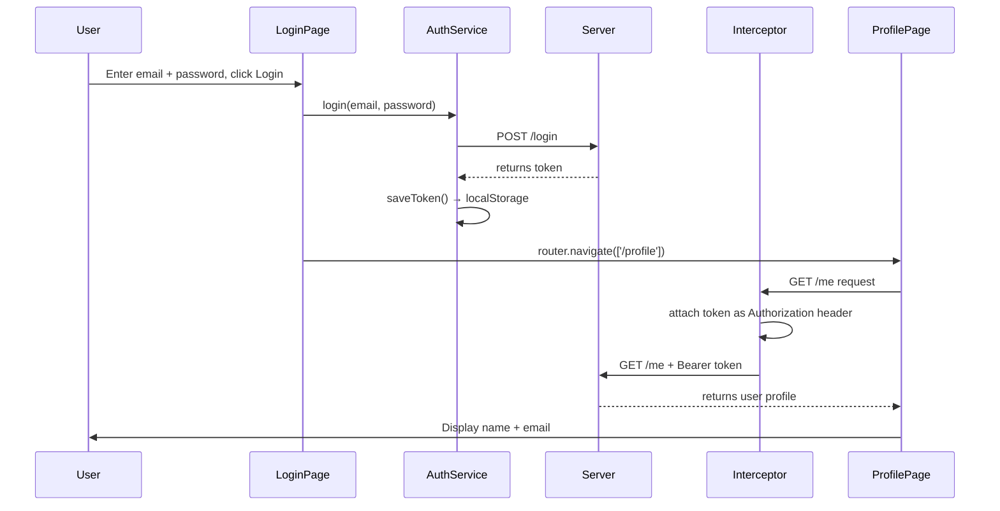
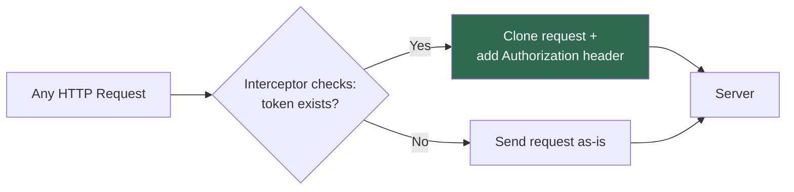
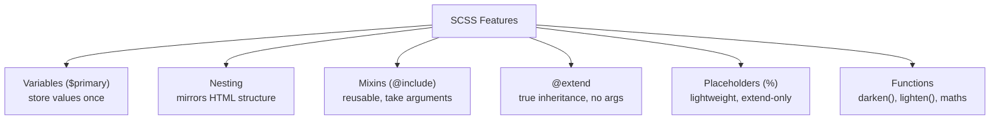

# Day 32 — Real Example: Login & Profile (ResumeForge Auth Flow)

##  Topics Covered
1. The whole login → profile flow, in one look
2. The Auth Service — login and saving the token
3. The Login Component
4. The Profile Service — fetching the user
5. The Interceptor — adding the token automatically
6. The Profile Component — showing the user
7. Routes — mapping login/profile pages
8. Styling with SCSS (variables, nesting, mixins, `@extend`)


---

## 1. The Whole Flow, In One Look

1. User types email and password in ResumeForge, clicks **Login**
2. The app sends them to the server → server replies with a **token**, which we save
3. We move to the **profile page**
4. The profile page asks the server for the user's data → the **interceptor** adds the saved token to that request
5. The server checks the token and returns the user's profile, which we show



---

## 2. The Auth Service (Login & Save the Token)

Login sends email and password with `POST`. When the token comes back, we save it. Simple and direct.

```typescript
// auth.service.ts
import { Injectable } from "@angular/core";
import { HttpClient } from "@angular/common/http";
import { Observable } from "rxjs";

@Injectable({ providedIn: "root" })
export class AuthService {
  private api = "https://api.resumeforge.com";

  constructor(private http: HttpClient) {}

  login(email: string, password: string): Observable<any> {
    return this.http.post(this.api + "/login", { email, password });
  }

  saveToken(token: string) {
    localStorage.setItem("token", token);
  }

  getToken() {
    return localStorage.getItem("token");
  }

  logout() {
    localStorage.removeItem("token");
  }
}
```

> The service just makes the call and returns it. Saving is a separate small method — each method does **one clear job**.

---

## 3. The Login Component

On submit, call `login` and subscribe. Inside the callback: save the token, go to profile. On error, show a message.

```typescript
// login.component.ts
export class LoginComponent {
  email = "";
  password = "";
  error = "";

  constructor(private auth: AuthService, private router: Router) {}

  onLogin() {
    this.auth.login(this.email, this.password).subscribe(
      (res: any) => {
        this.auth.saveToken(res.token);       // save the token
        this.router.navigate(["/profile"]);   // go to profile
      },
      (err) => {
        this.error = "Invalid email or password";
      }
    );
  }
}
```

```html
<!-- login.component.html -->
<input [(ngModel)]="email" placeholder="Email" />
<input [(ngModel)]="password" type="password" placeholder="Password" />
<button (click)="onLogin()">Login</button>
<p *ngIf="error">{{ error }}</p>
```

> **Why save the token here?** The token only arrives when the server replies — inside the `subscribe` callback. That's the moment we have it.
> **Order matters, and it's safe:** `saveToken` runs first (plain `localStorage.setItem`, instant), *then* `navigate` runs. By the time the profile page loads, the token is already saved.

---

## 4. The Profile Service (Fetch the User)

Just asks for the profile. **Doesn't** add the token by hand — the interceptor does that.

```typescript
// profile.service.ts
@Injectable({ providedIn: "root" })
export class ProfileService {
  private api = "https://api.resumeforge.com";

  constructor(private http: HttpClient) {}

  getProfile(): Observable<any> {
    return this.http.get(this.api + "/me");
  }
}
```

---

## 5. The Interceptor (Add Token to Every Request)

Every request passes through here. If a token exists, add it as a header — automatically.

```typescript
// auth.interceptor.ts
@Injectable()
export class AuthInterceptor implements HttpInterceptor {
  constructor(private auth: AuthService) {}

  intercept(req: HttpRequest<any>, next: HttpHandler) {
    const token = this.auth.getToken();
    if (token) {
      const cloned = req.clone({
        setHeaders: { Authorization: "Bearer " + token },
      });
      return next.handle(cloned);
    }
    return next.handle(req);
  }
}
```

**Register it in the module:**
```typescript
{ provide: HTTP_INTERCEPTORS, useClass: AuthInterceptor, multi: true }
```

Now the profile request — and **every** request — carries the token automatically.



---

## 6. The Profile Component (Show the User)

```typescript
// profile.component.ts
export class ProfileComponent implements OnInit {
  user: any = null;

  constructor(private profile: ProfileService) {}

  ngOnInit() {
    this.profile.getProfile().subscribe((data) => {
      this.user = data;
    });
  }
}
```

```html
<!-- profile.component.html -->
<div *ngIf="user">
  <h2>{{ user.name }}</h2>
  <p>{{ user.email }}</p>
</div>
```

---

## 7. The Routes (Login & Profile Pages)

```typescript
// app-routing.module.ts
import { NgModule } from "@angular/core";
import { RouterModule, Routes } from "@angular/router";
import { LoginComponent } from "./login/login.component";
import { ProfileComponent } from "./profile/profile.component";

const routes: Routes = [
  { path: "login", component: LoginComponent },
  { path: "profile", component: ProfileComponent },
  { path: "", redirectTo: "login", pathMatch: "full" }, // default page
];

@NgModule({
  imports: [RouterModule.forRoot(routes)],
  exports: [RouterModule],
})
export class AppRoutingModule {}
```

Also need a `<router-outlet>` in the main template:
```html
<!-- app.component.html -->
<router-outlet></router-outlet>
```

>  **Security gap noted:** Right now anyone can open `/profile` by typing the URL, even without logging in. A **route guard** can block that by checking for a token before letting the route open. Simple today — that's the next step to secure it.

---

## 8. Styling with SCSS

SCSS = CSS with variables, nesting, and reuse. Angular supports it out of the box. Files end in `.scss`.

### Variables + Nesting
```scss
// login.component.scss
$primary: #c0272d;
$radius: 6px;

.login-box {
  max-width: 320px;
  margin: 40px auto;
  padding: 24px;
  border-radius: $radius;

  input {
    width: 100%;
    padding: 10px;
    margin-bottom: 10px;
  }

  button {
    background: $primary;
    color: white;
    padding: 10px 16px;
    border: none;
    border-radius: $radius;

    &:hover {
      background: darken($primary, 10%);
    }
  }

  .error {
    color: $primary;
  }
}
```

> **Wins over plain CSS:** `$primary` stores the colour once · nested styles match the HTML structure · `&:hover` means `button:hover`. Change `$primary` in one place, the whole page follows.

>  **Tip:** Put shared values like `$primary` in one partial file (e.g. `_variables.scss`) and pull it into each component — the whole app shares one colour palette.

### Mixins — Reusable Blocks
```scss
@mixin flex-center {
  display: flex;
  align-items: center;
  justify-content: center;
}

.login-box {
  @include flex-center;
  flex-direction: column;
}
```

Mixins can take **arguments**:
```scss
@mixin button($bg) {
  background: $bg;
  color: white;
  padding: 10px 16px;
  border-radius: 6px;
}

.save-btn { @include button(#c0272d); }
.cancel-btn { @include button(#6b7a8f); }
```

### Inheritance with `@extend`
```scss
.btn {
  padding: 10px 16px;
  border-radius: 6px;
  border: none;
}

.save-btn {
  @extend .btn;
  background: $primary;
}

.cancel-btn {
  @extend .btn;
  background: #6b7a8f;
}
```

> **Simple rule:** Use a **mixin** when you need arguments or fresh styles each time. Use **`@extend`** when several selectors truly share the same base look.

### Operators, Functions & Placeholders
```scss
.col {
  width: 100% / 3; // maths
}

.button:hover {
  background: darken($primary, 10%); // colour function
}
```
Handy colour functions: `darken()`, `lighten()`, `rgba()`

**Placeholders (`%`)** — a lighter `@extend`, only appears in final CSS if extended:
```scss
%card-base {
  padding: 20px;
  border-radius: 6px;
  border: 1px solid #eee;
}

.profile-card { @extend %card-base; }
.resume-card { @extend %card-base; }
```



---

## 9. Key Takeaways 

- Login sends email and password, gets a token back, and saves it in the `subscribe` callback
- The token proves who the user is — protected requests must carry it
- The **interceptor** adds the token to every request automatically, so services never do it by hand
- **Routes** map `/login` and `/profile` to their components, shown in a `<router-outlet>`. A **guard** can protect `/profile` later
- **The payoff:** log in once, and every protected call just works
- SCSS: `$variables` for colours, nesting to match HTML, `@mixin`/`@include` for reusable blocks, `@extend` for inheritance — compiles to normal CSS

---


