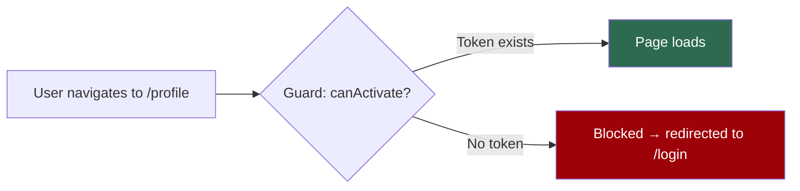
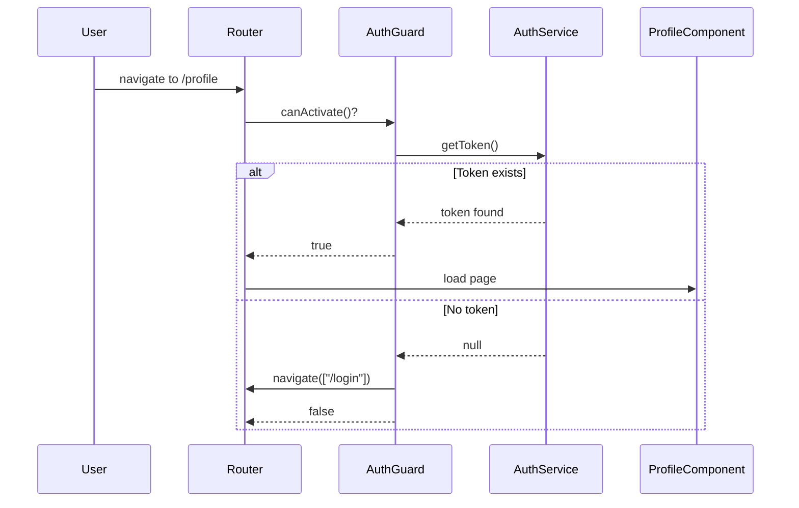
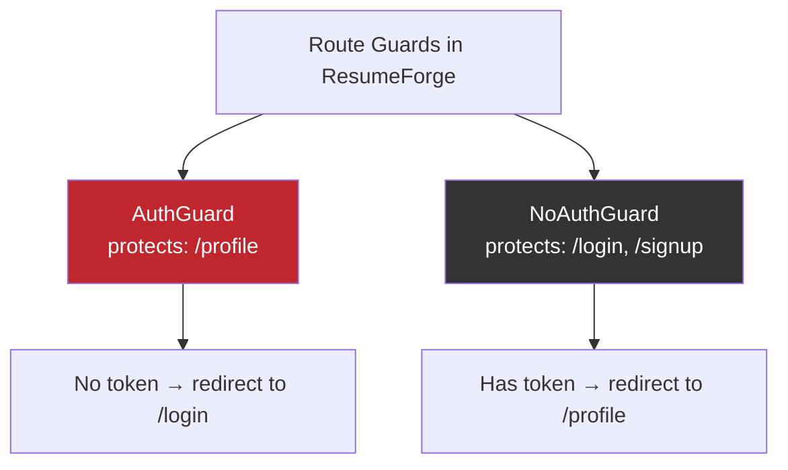
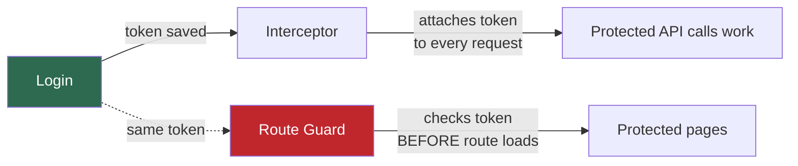
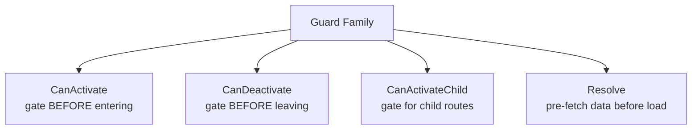

# Day 33 — Route Guards

##  Topics Covered
1. What a Route Guard is
2. Making a Guard (Angular 13 style) — `AuthGuard`
3. Putting the Guard on a Route
4. The Reverse Guard — `NoAuthGuard`
5. The Full Auth Story, Together
6. The Main Types of Guard (the family)

---

## 1. What is a Route Guard?

**Simple idea:** A route guard is a small piece of logic that runs **before** a route opens, and decides whether to allow it. If the check passes, the page loads. If not, the guard blocks it and usually sends the user somewhere else, like the login page.

> **One-liner:** A guard is a security gate in front of a route. It answers one question — *"is this user allowed in?"* — before the page is shown.

**The ResumeForge problem it solves:** the profile page should only open for a logged-in user. Without a guard, someone can skip login by typing the URL directly. The guard checks for a token first, and turns them away if it's missing.



---

## 2. Making a Guard (Angular 13 Style)

A guard is a **service** that implements `CanActivate`. The CLI creates one:
```bash
ng generate guard auth
```
(choose `CanActivate` when asked)

```typescript
// auth.guard.ts
import { Injectable } from "@angular/core";
import { CanActivate, Router } from "@angular/router";
import { AuthService } from "./auth.service";

@Injectable({ providedIn: "root" })
export class AuthGuard implements CanActivate {
  constructor(private auth: AuthService, private router: Router) {}

  canActivate(): boolean {
    if (this.auth.getToken()) {
      return true; // token exists, allow the page
    }
    // no token, send them to login and block the page
    this.router.navigate(["/login"]);
    return false;
  }
}
```

`canActivate()` returns `true` to allow the route or `false` to block it. Check for a token: if present → allow; if not → redirect to login and return `false`. **Simple gate.**

---

## 3. Putting the Guard on a Route

Add `canActivate` to the route you want to protect, in the routing module:

```typescript
// app-routing.module.ts
import { AuthGuard } from "./auth.guard";

const routes: Routes = [
  { path: "login", component: LoginComponent },
  {
    path: "profile",
    component: ProfileComponent,
    canActivate: [AuthGuard], // protected
  },
  { path: "", redirectTo: "login", pathMatch: "full" },
];
```

Now, before `/profile` opens, Angular runs `AuthGuard`. Logged in? The page shows. Not logged in? Straight to login. You can put the same guard on **any number of routes**.



---

## 4. The Reverse Guard: `NoAuthGuard`

There's a second, **opposite** need. If a user is already logged in, they shouldn't see the login or signup page again. Typing `/login` when already logged in should send them to their profile, not show the form.

`NoAuthGuard` does exactly this: it allows the page **only when there is no token**.

```typescript
// no-auth.guard.ts
import { Injectable } from "@angular/core";
import { CanActivate, Router } from "@angular/router";
import { AuthService } from "./auth.service";

@Injectable({ providedIn: "root" })
export class NoAuthGuard implements CanActivate {
  constructor(private auth: AuthService, private router: Router) {}

  canActivate(): boolean {
    if (!this.auth.getToken()) {
      return true; // no token, allow login/signup page
    }
    // already logged in, send them to profile
    this.router.navigate(["/profile"]);
    return false;
  }
}
```

> It's the **mirror image** of `AuthGuard`. `AuthGuard` allows the page when a token exists. `NoAuthGuard` allows the page when a token does **not** exist. One check, flipped.

**Put it on the login and signup routes:**

```typescript
// app-routing.module.ts
const routes: Routes = [
  { path: "login", component: LoginComponent, canActivate: [NoAuthGuard] },
  { path: "signup", component: SignupComponent, canActivate: [NoAuthGuard] },
  { path: "profile", component: ProfileComponent, canActivate: [AuthGuard] },
  { path: "", redirectTo: "login", pathMatch: "full" },
];
```

###  The Two Guards Side by Side

| Guard | Protects | If token exists | If token missing |
|---|---|---|---|
| `AuthGuard` | Private pages (e.g. profile) | Allow page | Redirect to `/login` |
| `NoAuthGuard` | Login/signup pages | Redirect to `/profile` | Allow page |

> Together they make navigation feel right: **logged-out users cannot reach private pages**, and **logged-in users are not shown the login form again**.



---

## 5. The Full Auth Story, Together

1. **Login** checks the user and gives a token, which we save
2. **The interceptor** attaches that token to every request, so the server knows who is asking
3. **The guard** protects the pages, so only a logged-in user can open them

> Three pieces, one system. Login + interceptor came first (Day 32). The guard **completes it**.



---

## 6. The Main Types of Guard (The Family)

`CanActivate` is the one used most, but good to know the full family:

| Guard | Runs When | Used For |
|---|---|---|
| `CanActivate` | Before entering a route | Block a page if not logged in |
| `CanDeactivate` | Before leaving a route | Warn about unsaved changes |
| `CanActivateChild` | Before entering child routes | Protect a group of pages at once |
| `Resolve` | Before a route loads | Fetch data so the page opens ready |

> **Nice one to know:** `CanDeactivate` can ask *"You have unsaved changes, leave anyway?"* when a user tries to navigate away from a half-filled form. Useful in a resume builder like ResumeForge.



---

## 7. Key Takeaways 

- A **route guard** is a gate that runs before a route and decides if the user may enter
- **`CanActivate`** is the common one: return `true` to allow, `false` to block
- **`AuthGuard`** checks for a token; if missing, redirects to login and blocks the page
- Attach it with `canActivate: [AuthGuard]` on the route
- **`NoAuthGuard`** is the reverse: keeps logged-in users away from login/signup, sending them to profile instead
- **The whole story:** login gets the token, the interceptor sends it, the guard protects the pages

---


