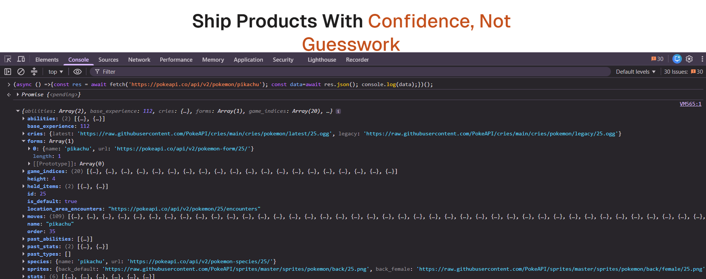

-----------------------------Day-9 TASK Objects & Array Methods-----------------------------------------

## 1. What is an object, really?

Imagine you're storing information about a student. Without objects, you'd end up with three separate loose variables floating around:

```js
let studentName = "Divya";
let studentRoll = 21;
let studentMarks = 88;
```

That's messy — nothing ties these three values together as *one* thing. An object solves this by bundling related data into key-value pairs, so it becomes one single "record":

```js
const student = {
  name: "Divya",
  roll: 21,
  marks: 88
};
```

Now `student` is one variable holding everything about that one student. This is the core idea of an object: **group related data under one name.**




## 2. Reading and writing values — dot vs bracket notation

There are two ways to reach inside an object and grab a value.

**Dot notation** — the one you'll use 90% of the time:
```js
console.log(student.name); // "Divya"
```
It's clean and easy to read, but it only works when you already know the exact key name while writing the code.

**Bracket notation** — needed when the key isn't fixed:
```js
const key = "marks";
console.log(student[key]); // 88 — the variable's value is used as the key
```
If you tried `student.key` instead, JavaScript would look for a property literally named `"key"`, which doesn't exist — so bracket notation is the only way to use a *variable* as a key.

## 3. Adding, updating, and deleting properties

```js
student.grade = "A";        // adding a brand-new property
student.name = "Divya B.";  // updating an existing one
delete student.grade;       // removing it completely
```

You can also check whether a property even exists before using it, which avoids bugs:
```js
"name" in student;               // true
student.hasOwnProperty("roll");  // true
student.age;                     // undefined — not an error, just empty
```

## 4. Methods and the `this` keyword

A **method** is nothing special — it's just a function that lives inside an object as one of its properties.

```js
const student = {
  name: "Divya",
  greet() {
    console.log(`Hi, I'm ${this.name}`);
  }
};
student.greet(); // "Hi, I'm Divya"
```

The keyword `this` inside a method refers to *the object the method was called on*. So when `student.greet()` runs, `this` becomes `student`, and `this.name` resolves to `"Divya"`.

One important trap: arrow functions don't get their own `this`. If you write a method as an arrow function, `this` won't point to the object anymore — it'll grab whatever `this` was in the surrounding code. So for object methods, stick to the regular `methodName() {}` syntax shown above.

## 5. Looping through an object

Since an object isn't a numbered list like an array, you can't use a normal `for` loop on it directly. Instead:

```js
for (const key in student) {
  console.log(key, student[key]);
}
```

Or use the built-in helper methods, which each give you a different slice of the object as an array:
```js
Object.keys(student);    // ["name", "roll", "marks"]
Object.values(student);  // ["Divya", 21, 88]
Object.entries(student); // [["name","Divya"], ["roll",21], ["marks",88]]
```

`Object.entries()` is the most useful of the three when you need *both* the key and the value at the same time — for example, while turning an object into a list of labeled rows.

## 6. Nested objects

Objects can contain other objects inside them, which lets you model real-world data more accurately:

```js
const student = {
  name: "Divya",
  address: {
    city: "Haldwani",
    state: "Uttarakhand"
  }
};

console.log(student.address.city); // "Haldwani"
```

You just chain dots to go one level deeper each time. If you're not sure a nested property exists, optional chaining prevents a crash:
```js
console.log(student.address?.pincode); // undefined instead of an error
```

## 7. Arrays of objects — the shape real API data comes in

This is the big one. Almost every real API doesn't hand back a single object — it hands back a **list of objects**:

```js
const users = [
  { id: 1, name: "Divya", active: true },
  { id: 2, name: "Bhumika", active: false }
];
```

This is exactly what you get back from `response.json()` when calling a real API, which is why getting comfortable with array methods matters so much — this is the shape you'll be working with constantly.

## 8. Array methods, one by one

**`forEach`** — runs a function once per item. Returns nothing. Use it purely for side effects like logging.
```js
users.forEach(u => console.log(u.name));
```

**`map`** — transforms every item into something new, and gives back a brand-new array of the *same length*.
```js
const names = users.map(u => u.name); // ["Divya", "Rahul"]
```

**`filter`** — keeps only the items that pass a test, and gives back a new array that may be *shorter*.
```js
const activeUsers = users.filter(u => u.active); // [{id:1, name:"Divya", active:true}]
```

**`find`** — returns the *first* item that matches, or `undefined` if nothing matches. Unlike filter, it stops as soon as it finds one.
```js
const rahul = users.find(u => u.name === "Rahul");
```

**`some`** — asks "does at least one item match?" and returns `true`/`false`.
```js
const hasActive = users.some(u => u.active); // true
```

**`every`** — asks "do ALL items match?" and returns `true`/`false`.
```js
const allActive = users.every(u => u.active); // false, since Rahul isn't active
```

**`sort`** — sorts the array. Important: this changes the *original* array in place, it doesn't make a copy.
```js
users.sort((a, b) => a.id - b.id);
```

**`reduce`** — the most flexible one. It walks through the array and collapses it down into a single value (a total, a count, even a brand-new object).
```js
const activeCount = users.reduce((total, u) => u.active ? total + 1 : total, 0);
// 1
```

### Chaining methods together
Because `map`, `filter`, and `sort` all return arrays, you can chain them one after another:
```js
const activeNames = users.filter(u => u.active).map(u => u.name);
// ["Divya"]
```

## Key takeaway

An **object** groups related data together as one "thing." 
An **array** is an ordered list of things. Knowing exactly what each array method hands back saves a lot of debugging later: `map`, `filter`, and `sort` give you arrays back, 
`find` gives you one item, 
`reduce` gives you one value, and
 `forEach` gives you nothing at all — it's only for side effects.

---


